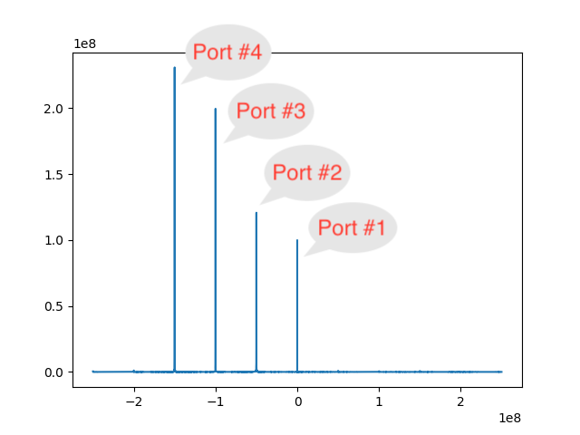
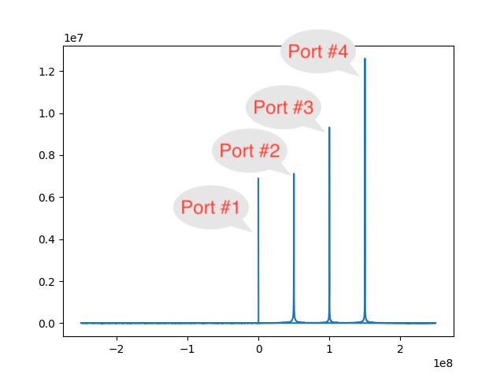

# basic_box_test.py

QuEL-1 (FY2022) の各出力ポートからCWを出力するテストスクリプト。
QuEL-1のループバック機能を利用した簡易スペクトラムアナライザ機能も提供する。

## 環境構築
Python3.8の新しい仮想環境を作成し、e7awgsw と quel_ic_config の2つのパッケージをインストールする。
```shell
python3.8 -m venv test_venv
source test_venv/bin/activate
pip install -U pip
pip install packages/e7awg_sw-1.0-py3-none-any.whl
pip install packages/quel_ic_config-0.4.9-cp38-cp38-linux_x86_64.whl
```

## 実行
コンフィグ系のIPアドレスが10.5.0.54、ウェーブ系のIPアドレスが 10.1.0.54 の制御装置を使用する場合は次のようにスクリプトを起動する。
ただし、この制御装置がType-Bであるとする。Type-Aの場合には、`--boxtype quel1-a` とする。

```shell
python -i basic_box_test.py --ipaddr_css 10.5.0.54 --ipaddr_wss 10.1.0.54 --ipaddr_sss 10.2.0.54 --boxtype quel1-b
```

正常にリンクアップできた場合には、ログの最後の行は次ようになる。
```text
2023-08-25 16:56:37,075 [INFO] __main__: successful link-up of mxfe-1
```

例外が発生している場合には、どちらかのAD9082がリンクアップに失敗していることを示す。
スクリプトを再実行しても症状が改善しない場合には、**制御装置本体をパワーサイクル**することをお薦めする。
それでも、症状が繰り返される場合にはサポートに連絡をして頂きたい。


## 各ICの設定
上記スクリプト内で次のようにすると、各ICにテスト用の設定が適用される。
```python
box.config_all()
```

## 波形出力例
上記の「各ICの設定」まで実施した後で次のようにする。

### 全ての出力ポートから同時にCWを出力したい場合。
Port #1 から、10GHz, Port　#2 から 9.95GHz, ... Port #11 から 9.65GHz を出力する。
8つの出力チャネルの出力をコンバイナを介して同時に観測すると、50MHz刻みに8本のピークが立つはずである。
ただし、Type-Aユニットの Port #3 と port #10 には逓倍器が入っているので、逓倍されたCWが出力される。

```python
box.open_all()  # RFスイッチを全て開く。
box.start_all()  # 全ての出力ポートから波形出力を開始する。
```

止める場合は次のようにする。
```python
box.stop_all()
box.close_all()
```

### 全ての出力ポートをひとつづつ出力したい場合。
各ポートごとに、出力を開始し、RFスイッチを開けて、4秒待ち、スイッチを閉じて、出力を止めて、2秒待つ、
という動作を8ポート分に繰り返す。
```python
box.scan_all()
```

### 各ポートを細かく弄りたい場合
box オブジェクトの次のメソッドを使っていろいろ試すことができる。引数詳細は __doc__ を参照していただきたい。

- config_port()： 指定ポート固有のパラメタを設定する。
- config_channel()： 指定ポート内のチャネライザのパラメタを設定する。現状はDACのFNCO だけ。
- open_port()： 指定ポートのRFスイッチを開く。
- start_channel()： 指定ポートの指定チャネルから CW の出力を開始する。
- stop_channel()： 指定ポート内の指定チャネルの出力を停止する。
- close_port()： 指定ポートのRFスイッチを閉じる。


## ループバック系を使った信号スペクラムの取得
次のようにして、Port #1 ~ #4 及び #8 〜 #11 の出力信号を500MHz帯域幅でキャプチャし、
それぞれのスペクトラムをpngファイルに描き出すことができる。
```python
box.loopback_fft(0, "port1234_spectrum.png")
box.loopback_fft(1, "port89ab_spectrum.png")
```

Type-Aユニットの場合には、`box.config_all()` と `box.start_all()` を行った後に、
上記コマンドを実行することで、`port1234_spectrum.png`ファイルには、次のような出力が得られる。



`basic_box_test.py`スクリプト起動時に`--config_options`オプションで特に指定しない限り、モニタ系のADCがFPGAに接続される。
グループ0のモニタ系は、Port #1〜#4の出力が内部的に覗き見できるように結線してある。
ただし、Type-Aのユニットについては、Port #3 のポンプ信号ではなく、その元になっている逓倍前の信号が接続されていることに注意が必要である。

`config_all()` はPort #1〜#4 のRF信号の中心周波数をそれぞれ、10.0GHz, 9.95GHz, 9.9GHz, 9.85GHz に設定する。
これらの信号の一部がモニタ系に入力し、ADCの手前にあるダウンミキサと、ADCの後段にある数値的ダウンミキサとによって、
-250MHz〜250MHzの範囲の信号に変換の後、画像ファイルに書き出される。

Type-Aの場合、ダウンミキサはPort #3のローカルオシレータ（8.5GHzに設定）の出力をつかって、RF信号をダウンコンバートする。
グループ0の数値的ダウンミキサに付属の数値的ローカルオシレータは、`config_all()`内で 1.5GHzに設定される。
結果、次のようなピークが得られる。
上のグラフと見比べて頂きたい。
なお、グラフの強度のばらつきはモニタ経路の周波数特性などによって発生している。
実際に各ポートから出力するRF信号の強度には、このような大きなバラツキはない。

| Type | Group | Port | RF周波数 (GHz) | グラフ中のピーク位置 (GHz) |
|:----:|:-----:|:----:|:-----------:|:----------------:|
|  A   |   0   |  1   |    10.00    |       0.00       |
|  A   |   0   |  2   |    9.95     |      -0.05       |
|  A   |   0   |  3   |    9.90     |      -0.10       |
|  A   |   0   |  4   |    9.85     |      -0.15       |

Type-A のグループ１(後半ポート, #8, #9, #10, #11) についても同様のグラフが得られる。
ただし、数値的ダウンミキサの数値的ローカルオシレータの周波数が1.3GHz に設定するので、次のようなピークを観察できるはずだ。

| Type | Group | Port | RF周波数 (GHz) | グラフ中のピーク位置 (GHz) |
|:----:|:-----:|:----:|:-----------:|:----------------:|
|  A   |   1   |  8   |    9.80     |       0.00       |
|  A   |   1   |  9   |    9.75     |      -0.05       |
|  A   |   1   |  10  |    9.70     |      -0.10       |
|  A   |   1   |  11  |    9.65     |      -0.15       |


Type-B については、ADC手前のミキサに Port #2 のローカルオシレータ（11.5GHz) が入力している都合で、
グラフの周波数軸の向きが逆になるので注意が必要だ。
`config_all()`が設定する各ポートのRF周波数は Type-AとType-Bで共通だが、得られる画像ファイルの内容は次のようになる。



ピークの位置は次のようになる。

| Type | Group | Port | RF周波数 (GHz) | グラフ中のピーク位置 (GHz) |
|:----:|:-----:|:----:|:-----------:|:----------------:|
|  B   |   0   |  1   |    10.00    |       0.00       |
|  B   |   0   |  2   |    9.95     |       0.05       |
|  B   |   0   |  3   |    9.90     |       0.10       |
|  B   |   0   |  4   |    9.85     |       0.15       |
|  B   |   1   |  8   |    9.80     |       0.00       |
|  B   |   1   |  9   |    9.75     |       0.05       |
|  B   |   1   |  10  |    9.70     |       0.10       |
|  B   |   1   |  11  |    9.65     |       0.15       |

### ループバックにリード系を使う場合の注意
なお、スクリプト起動時に`--config_options use_read_in_mxfe0,use_read_in_mxfe1` を指定して、リード系のADCをFPGAに接続した場合には、
Type-A では Port #1 と Port #8 の出力だけしかキャプチャできなくなり、また、Type-B では出力が何も得られなくなるので注意が必要である。
Type-B においてなんらかのピークが見えたとしても、それらは出力信号ではなく、微弱な漏れ信号である。
通常の場合に比べて縦軸が桁違いに小さくなっていることで判別できる。
また、リード系のループバック経路を使うためには、リード系の出力ポートのRFスイッチを内向きにする必要があるので、外部への信号出力が得られなくなる点
にも注意が必要である。
