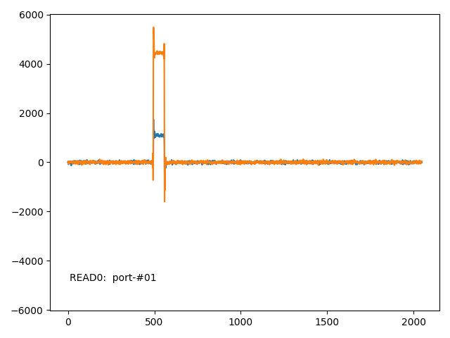
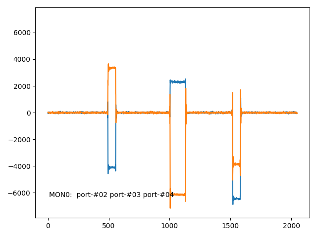
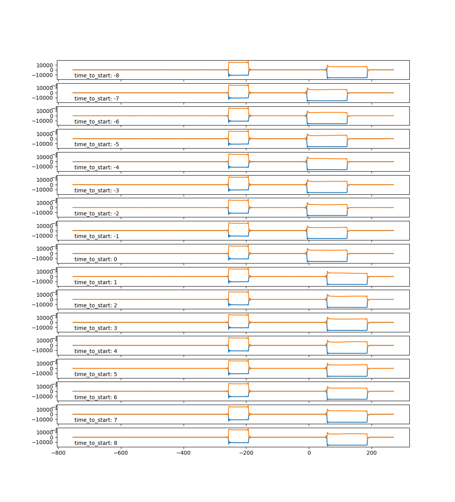

# サンプルコードの使い方
[`scripts`](./scripts) ディレクトリ内のサンプルコードの内容と使い方を説明する。

## 準備
[GETTING_STARTED.md](./GETTING_STARTED.md) の手順にしたがって、実行環境を構築する必要がある。
サンプルコードの依存パッケージを解消するために `requirements_dev_addon.md` もインストールしておくとよい。

## quel1_check_all_internal_loopbacks.py
QuEL-1 Type-A/B および QuBE RIKEN Type-A/B の信号入出力の健全性を内部ループバック経路を使用して確認するためのツールである。
対象の装置のIPアドレス(`--ipaddr_wss`)と装置モデル名(`--boxtype`)、クロックマスタのIPアドレス(`--ipaddr_clk`)を指定して使用する。
クロックマスタの指定が必要なのは、波形発生を時刻カウンタをトリガにして行っているからである。
なので、対象装置のシーケンサの動作確認も同時に行うことになる。

### 制限事項
SIMPLEMULTI_STANDARD のファームウェア以外のファームウェアには対応していない。
というのは、Read-inとMonitor-in の同時使用能力とSIMPLEMULTIのタイムトリガ波形生成の機能との両方が必要だからである。

### 使用例
たとえば、動作確認対象の装置が QuEL-1 Type-A で IPアドレスが`10.1.0.58`、クロックマスタのIPアドレスが`10.3.0.13`の場合、
次のようなコマンドで全ての入出力ポートの動作確認をできる。
```shell
PYTHONPATH=. python scripts/quel1_check_all_internal_loopbacks.py --ipaddr_clk 10.3.0.13 --ipaddr_wss 10.1.0.58 --boxtype quel1-a
```

QuEL-1 Type-A は4つの入力ポートを持つので、各入力ポートごとに装置内ループバック経路がある出力ポート群の信号を取得し、そのベースバンド信号の波形を表示する。
まず、ポート0（read-in) に内部でループバックできるのは、ポート1(read-out)だけである。
したがって、最初に表示されるグラフは次のようになる。
ポート1 から出力した短い矩形パルスが、ポート0にて正しくキャプチャできていることが見て取れる。



横軸はキャプチャ開始からのサンプル数、縦軸はADCの読み値である。
サンプリングレートは500Mspsなので、1サンプルが2nsの時間に対応する。
グラフはそれぞれ、ベースバンド信号の実部(青)と虚部(オレンジ)である。

グラフの表示と共に、コンソールログに詳細な情報が出力されている。
```text
2024-05-09 18:52:42,198 [INFO] testlibs.general_looptest_common_updated: number_of_chunks: 1
2024-05-09 18:52:42,198 [INFO] testlibs.general_looptest_common_updated:   chunk 0: 63 samples, (494 -- 557)
```
ここから読み取れるのは、キャプチャ開始後494サンプル目から、長さが63サンプルの矩形波が受信できたことである。
実際には、ポート1から64サンプルの矩形波を出力しているが、パルスの検出閾値如何で2サンプル程度は前後するので、正しくキャプチャできていると言える。
信号発生開始と同時にキャプチャも開始しているが、ADC及びFPGAでの信号処理の遅延などで、波形が得られるまで間がある。
この遅延量はMxFEのリンクアップ毎にバラツキがあるが、再リンクアップするまでは一定に保たれる。
ここで `q`を押すと、次のキャプチャに進む。

2つめのグラフは、ポート5（monitor-in)のキャプチャデータである。
ポート1, ポート2, ポート3, ポート4 の出力をループバックする内部経路があるが、ポート1については既に確認できているので省いている。
ポート3のSMA端からの出力は2逓倍した信号になるが、ループバックされるのは逓倍前の信号であることに注意が必要である。



ポート2から64サンプルの矩形波、ポート3から128サンプルの矩形波、ポート4から64サンプルの矩形波を出力している。
ポート2の波形はキャプチャ開始と同時に、ポート3の波形は512サンプル遅れ、ポート4の波形は1024サンプル遅れで出力している。
以下に示すコンソールログからも、実際の出力波形と整合的な結果が得られていることが分かる。
```text
2024-05-09 18:53:01,281 [INFO] testlibs.general_looptest_common_updated: number_of_chunks: 3
2024-05-09 18:53:01,281 [INFO] testlibs.general_looptest_common_updated:   chunk 0: 64 samples, (493 -- 557)
2024-05-09 18:53:01,281 [INFO] testlibs.general_looptest_common_updated:   chunk 1: 128 samples, (1004 -- 1132)
2024-05-09 18:53:01,281 [INFO] testlibs.general_looptest_common_updated:   chunk 2: 65 samples, (1517 -- 1582)
```

この後、ポート7(read-in)、ポート12（monitor-in)　と続くが同様のデータが得られる。

## quel1se_check_all_internal_loopbacks.py
上記のスクリプトの QuEL-1 SE RIKEN-8 版である。
使い方は基本同じだが、`--boxtype`を与える必要はない。
QuEL-1 SE RIKEN-8 はそれまでのQuEL-1 と異なり、モニタ系の入力にLNAを持たないので、モニタ系でキャプチャした信号の振幅がリード系の 1/10 程度になる。

## quel1_monitor_synchronized_output.py
上述の`quel1_check_all_internal_loopbacks.py`は、QuBE OU Type-B のような入力ポートが一切ない装置では使うことができない。
これに対応するために、測定対象の出力ポートの出力波形を、別の機体の入力ポートで測定するスクリプトを用意した。

装置を跨いで波形生成とキャプチャを同期的に行うには、キャプチャの開始を同じ機体の任意の出力ポートの出力開始でトリガする必要がある。
したがって、スクリプトは3つのポート、つまり、入力ポート、動作確認対象の出力ポートに加えて、トリガポートを必要とする。
この際に、トリガポートと出力ポートをコンバイナを介して入力ポートへ接続するのが理想的である。
スクリプトは、トリガポートからトリガと同時に64サンプルのパルスを発生し、出力ポートから256サンプル遅れで128サンプルのパルスを発生する。
この両方のパルスをキャプチャすることで、装置間のタイミングを詳細に確認することもできる。

### 制限事項
QuEL-1 SE はこのスクリプトではサポート外である。
いずれ、QuEL-1 SE用の同等のスクリプトも提供する予定である。

### 使用例
QuEL-1 Type-A である10.1.0.58のポート5で、QuEL-1 Type-B である10.1.0.60 のポート4の出力波形をキャプチャする場合を考える。
ポート5のキャプチャ開始には、同機のポート2を使用する。
次のコマンドの実行に先立って、10.1.0.58のポート2と10.1.0.60のポート4を2対1のコンバイナで合波し、10.1.0.58のポート5に接続しておく。
```shell
PYTHONPATH=. python scripts/quel1_monitor_synchronized_output.py --ipaddr_clk 10.3.0.13 \
--ipaddr_wss_a 10.1.0.58 --boxtype_a quel1-a --input_port 5 --trigger_port 2 \
--ipaddr_wss_b 10.1.0.60 --boxtype_b quel1-b --output_port 4
```

次のようなコンソールログとキャプチャ波形とが得られるはずである。
```
2024-05-09 23:54:38,664 [INFO] testlibs.general_looptest_common_updated: number_of_chunks: 2
2024-05-09 23:54:38,664 [INFO] testlibs.general_looptest_common_updated:   chunk 0: 64 samples, (497 -- 561)
2024-05-09 23:54:38,664 [INFO] testlibs.general_looptest_common_updated:   chunk 1: 130 samples, (746 -- 876)
```


1つ目のパルスがトリガポートからのパルスで、キャプチャ開始から497サンプル目に取得できている。
2つ目の幅が広いパルスが動作確認対象の出力ポートからのパルスで、249 (= 746 - 497) サンプル遅れでキャプチャできている。
両方のポートから入力ポートまでの経路長が同じで、かつ、2台の制御装置が完全に同期しており、かつ、波形発生のタイミングが装置間でアラインメントが取れていれば、256サンプル遅れになるはずである。
経路長はほぼ同じにしており、かつ、時刻カウンタの補正を施した状態でなので、タイミングのずれの原因は、波形発生のタイミングがアラインメントの問題であると推測できる。
波形発生のタイミングは64サンプルに単位でしかずらせないので、10.1.0.60に与える波形データの最初に6ないし7サンプルのゼロを挿入すればタイミングが揃うはずだ。

## quel1_monitor_synchronized_output_advanced.py
先述の `quel1_monitor_synchronized_output.py` を仕立て直して、装置間のスキュー調整を手動で試すためのスクリプトとしたものである。
元になったスクリプトが使用している `BoxPool.emit_at()` の `time_count` 引数は波形発生のタイミングを相対的に指定するが、
装置間同期に用いているSYSREFクロックのエッジのタイミングを考慮して、波形発生の絶対タイミングを決定している。
具体的には、time_count が 0 のときに、SYSREFクロックのエッジに対して、波形チャンクの単位サイズ(64サンプル、128ns, 125MHzのシステムクロックで16クロック)の倍数時間後のタイミングに波形要求のトリガを出す。

このスクリプトでは、波形発生のタイミングをこの境界に対し、-8クロックから8クロックまでのオフセットを与えながら元のスクリプトの手順を繰り返し実行し、グラフとレポートを表示する。
なお、オフセットが0の場合が、元のスクリプトと同じ動作となる。
使い方も元のスクリプトと同じであるが、いくつか引数が追加されているので、次のコマンドを実行した場合グラフを見ながら、順を追って説明していく。

```shell
PYTHONPATH=. python scripts/quel1_monitor_synchronized_output_advanced.py --ipaddr_clk 10.3.0.13 \
--ipaddr_wss_a 10.1.0.58 --boxtype_a quel1-a --input_port 5 --trigger_port 2 \
--ipaddr_wss_b 10.1.0.60 --boxtype_b quel1-b --output_port 4
```



ここで、オフセット値（グラフ中では`time_to_start:`の後ろの値）のある値を境に64サンプルずれる現象が発生することが分かる。
この「ずれ」はトリガのオフセット値の16の剰余に依存して決まる。
しかし、「ずれ」が起こる具体的なオフセット値は、リンクアップをする度に変化するので、キャリブレーション時に考慮する必要がある。
特に「ずれ」の切り替わり点では、期待どおりのタイミングで波形発生がはじまるか、あるいは、64サンプル遅れになるかが、低い確率ではあるがバタつくことがあるので、
境界すれすれのタイミングでトリガを掛けるのは避けるべきである。
上の図の場合では、オフセットを -3 あたりでトリガを掛けるのが安全であることが分かる。

グラフの横軸の原点は、測定対象ポートからのパルス発生の期待値に合わせてある。
つまり、トリガポートのパルスのエッジから`--output_delay`サンプル（デフォルト値は256) だけ遅れたサンプルを0としている。
オフセット値が-7から0 の場合に注目すると、期待値よりもやや早く波形発生が始まってしまっている。
一方で、オフセット値が1から8の場合では大きく遅れているので、-7から0の方が期待どおりの挙動に近い。
コマンドのコンソールログに、これらについて詳しい情報を表示している。
```shell
2024-05-10 20:35:01,611 [INFO] root: expected start time of the pulse: 753.0
2024-05-10 20:35:01,612 [INFO] root: actual start time of the pulse at the offset of -8: 811.0
2024-05-10 20:35:01,612 [INFO] root: actual start time of the pulse at the offset of -7: 747.0
2024-05-10 20:35:01,612 [INFO] root: actual start time of the pulse at the offset of -6: 747.0
2024-05-10 20:35:01,612 [INFO] root: actual start time of the pulse at the offset of -5: 747.0
2024-05-10 20:35:01,612 [INFO] root: actual start time of the pulse at the offset of -4: 747.0
2024-05-10 20:35:01,612 [INFO] root: actual start time of the pulse at the offset of -3: 747.0
2024-05-10 20:35:01,612 [INFO] root: actual start time of the pulse at the offset of -2: 747.0
2024-05-10 20:35:01,612 [INFO] root: actual start time of the pulse at the offset of -1: 747.0
2024-05-10 20:35:01,612 [INFO] root: actual start time of the pulse at the offset of 0: 747.0
2024-05-10 20:35:01,612 [INFO] root: actual start time of the pulse at the offset of 1: 811.0
2024-05-10 20:35:01,612 [INFO] root: actual start time of the pulse at the offset of 2: 811.0
2024-05-10 20:35:01,612 [INFO] root: actual start time of the pulse at the offset of 3: 811.0
2024-05-10 20:35:01,612 [INFO] root: actual start time of the pulse at the offset of 4: 811.0
2024-05-10 20:35:01,612 [INFO] root: actual start time of the pulse at the offset of 5: 811.0
2024-05-10 20:35:01,612 [INFO] root: actual start time of the pulse at the offset of 6: 811.0
2024-05-10 20:35:01,612 [INFO] root: actual start time of the pulse at the offset of 7: 811.0
2024-05-10 20:35:01,612 [INFO] root: actual start time of the pulse at the offset of 8: 811.0
```

このログから、パルスの発生タイミングの期待値(753サンプル目)よりも、6クロック早くパルスが出ていることが分かる。

そこで、`--sample_shift 6` を引数に追加すると、波形データの先頭にゼロを6サンプル追加する。
その結果、期待どおりのタイミングで波形発生ができるようになる。
ゼロのサンプルを減らしたい場合には、`--output_delay_delta` を使って、AWGのdelay機能も併用できる。
ただし、こちらの値は4の倍数でなければならない。

というように、10.1.0.58 と 10.1.0.60 との波形発生のタイミングをSMA端で合わせる場合には、10.1.0.60の波形データにゼロを6サンプル挿入すればよいことが分かる。
また、トリガタイミングを -3 ずらしておくと、安心である。
このことは、次のコマンドで確認できる。
```shell
PYTHONPATH=. python scripts/quel1_monitor_synchronized_output_advanced.py --ipaddr_clk 10.3.0.13 \
--ipaddr_wss_a 10.1.0.58 --boxtype_a quel1-a --input_port 5 --trigger_port 2 \
--ipaddr_wss_b 10.1.0.60 --boxtype_b quel1-b --output_port 4 \
--sample_shift 6 --trigger_offset -3
```

`time_to_start: 0`のグラフが、期待通りのタイミングで波形発生できるオフセットの中央にきていることが見て取れる。


## getting_started_example.py
[GETTING_STARTED.md](./GETTING_STARTED.md) にて説明しているので、そちらを参照していただきたい。
