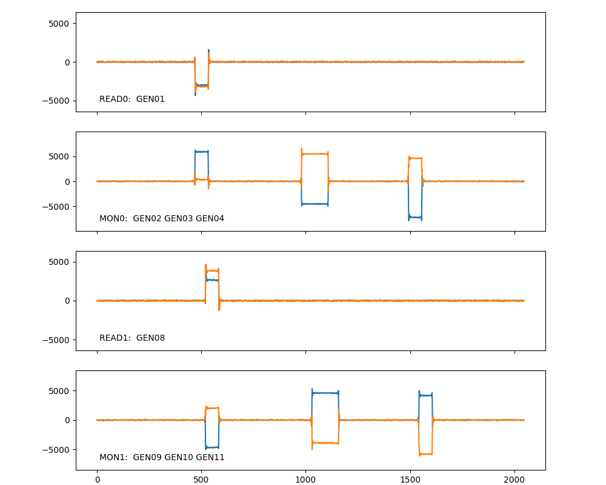
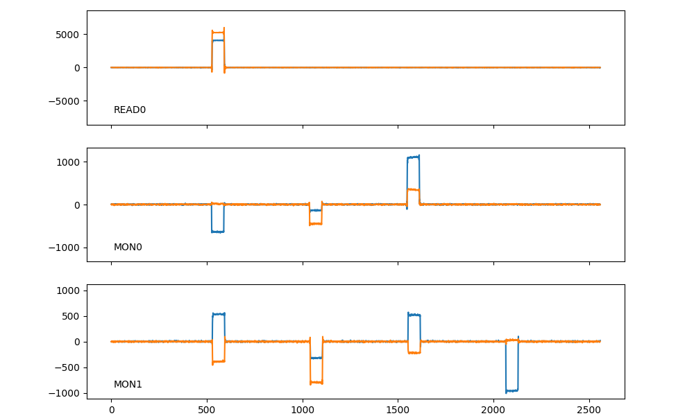

# quel_ic_config を使ってみる
[quelwareリポジトリ](https://github.com/quel-inc/quelware)を取得するところから、CLIコマンドやハイレベルAPIの基本的な動作を確認するまでを説明する。
以下の手順の動作確認は、Ubuntu 20.04.6 LTS で行っているが、他のLinuxディストリビューションでも同様の手順で環境構築ができるはずだ。

## 0.10.x 系の変更点
- 今後のファームウェアの抜本的なアップデートへの対応準備と安定性向上の目的で、e7awgsw を e7awghal で置き換えた。これに伴い、いくつかの制限事項が発生する。
    - READ-IN と MONITOR-IN が同時に使えない古いファームウェアのサポートを停止。
    - Feedback実験版のファームウェアのサポートを一時的に停止させて頂いた。要望があればサポートを再開するが、キュエル社としてはフィードバック機能を再設計したファームウェア開発後に対応再開としたいと考えている。
        - それまでは、0.8.x系の quelware をご使用頂きたい。 
- WaveSubsystem を再設計したことに伴い、波形生成及び波形取得に関するAPIを大幅に変更した。詳細は[こちら](./MIGRATION_TO_0_10_X.md)。
    - WaveSubsystemのAPIはこれで固定。AD9082の500MHz情報帯域の出力チャネル（channel) をそのままユーザに見せるAPI、という位置づけ。
    - 一方で、measurement tools のバーチャルポート相当の、量子ビットや読み出し共振器の共振周波数を中心とする比較的狭帯域の位相管理された出力ユニット（tunit) に基づくインターフェースを別途開発する予定。
- 各装置の排他ロック機能が更新されている。従来は、e7awgswがファームウェアの一部について排他制御をしていたが、これを次のように改めた。
    - 1台の制御装置全体に排他制御が掛かるようにした。ある装置に対応するboxオブジェクトが存在している間は、他ユーザがその装置のboxオブジェクトを作成できなくなる。
    - QuEL-1以前の装置では、これまで通りロックファイルを用いた排他制御を行う。
        - ロックファイルの置き場を、`/var/run/quelware` ディレクトリに変更した。このディレクトリのパーミッションは運用ポリシーに応じて調整して頂きたい。
    - QuEL-1 SE以降については、ロックファイルを用いる代わりにデバイスそのものにロックを掛けることもできる。
        - 各ICの設定は、他のユーザの任意のホストからの書き換えアクセスを遮断できる。
        - AU50の設定は、quelware-0.10.x 以降を使用している場合に限り、他のユーザの任意のホストからの書き換えアクセスを遮断できる。
        - デバイスロックは、ExStickGEのファームウェアをv1.3.0 以降での対応となる。
            - ExStickGEのファームウエアのOTA アップデートするツールで、簡単にアップデートを実施できる。

## 環境構築
### システムへの依存パッケージのインストール
サンプルスクリプトやテストコードにて、グラフの表示に matplotlib を用いている。
Qt5Aggを使いたいところではあるが商用ライセンスを購入しないとGPLが適用されてしまうので、quelwareの配布物では Gtk3Agg を使用する。
quelwareの開発に参加したり、サンプルスクリプトを使用する場合には、以下の手順でパッケージのインストールをしておく必要がある。
```shell
sudo apt install libgirepository1.0-dev gcc libcairo2-dev pkg-config python3-dev gir1.2-gtk-3.0
```

### Python仮想環境の作成
任意の作業ディレクトリで以下の手順を実行すると、新しい仮想環境が利用可能な状態になる。
```shell
python3.9 -m venv test_venv
source test_venv/bin/activate
pip install -U pip
```

### リポジトリの取得
リポジトリのクローンがまだであれば、適当な作業ディレクトリに移動の後、次のコマンドで本リポジトリをクローンし、quel_ic_config ディレクトリに移動する。
```shell
git clone git@github.com:quel-inc/quelware.git
cd quelware/quel_ic_config
```

### コンパイル済みパッケージの取得と展開
次のコマンドを実行すると、 コンパイル済みのパッケージをリポジトリの[リリースページ](https://github.com/quel-inc/quelware/releases/)から自動で取得する。
```shell
./download_prebuilt.sh
tar xfv quelware_prebuilt.tgz  
```

`wget` コマンドが無い場合には事前にインストールするか、手動でのダウンロードをすることになる。
```shell
sudo apt install wget
```

### インストール
今後は、全ての制御装置ファームウェアに対応した単一のパッケージを配布するので、これまでのような装置のファームウェアの種類によって、パッケージ
を選択する必要はない。
とはいうものの、現状、quelware-0.10.x が対応しているファームウェアはSIMPLEMULTI_STANDARDの1種類だけである。
古いSIMPLEMULTI_CLASSICのファームウェアはサポート中止であり、また、ベータ版配布のFEEDBACK_EARLYファームウェアは、一時的にサポートを停止している。

| ファームウェアの種類の名前　       | 概略                                                                     | 
|----------------------|------------------------------------------------------------------------|
| SIMPLEMULTI_CLASSIC  | 20240125より前のsimplemulti版ファームウェア <br> 本リリースで対応廃止となったのでファームウェアのアップデートが必要 |
| SIMPLEMULTI_STANDARD | 20240125以降のsimplemulti版ファームウェア <br> QuEL-1 SE 及びNEC様向けモデルの標準ファームウェア    |
| FEEDBACK_EARLY       | フィードバック研究用の実験なファームウェア（特定ユーザ様専用）<br> サポートを一時停止中。                       |

実験室で使用中の制御装置のほとんど全てに、SIMPLEMULTI_STARNDARD版のファームウェアがインストールされているという認識だが、
心配であれば、以下のコマンドで各装置のファームウェア情報を確認できる。

```text
quel1_firmware_version --boxtype xxxxx --ipaddr_wss 10.1.0.yyy
```

#### `SIMPLEMULTI_CLASSIC`の場合
ほとんど全ての制御装置のファームウェアがSIMPLEMULTI_STANDARDに更新された状況を鑑みて、本リリースで対応中止とした。
もし、SIMPLEMULTI_CLASSICのファームウェアをインストールしている機体は、従来の0.8.x系のquelwareで使用するか、あるいは、ファームウェアのアップデートが必要である。

#### `SIMPLEMULTI_STANDARD`の場合
次のコマンドでパッケージをインストールする。
```shell
pip install -r requirements.txt
```

ファームウェアアップデートツールなどの開発用のツール群が必要な場合や、quel_ic_config本体のリビルドをしたい場合には、こちらをインストールするのが便利である。
```text
pip install -r requirements_dev.txt
```

#### `FEEDBACK_EARLY`の場合
FEEDBACK_EARLY版のファームウェアはベータ版として配布しているが、コマンドシーケンサ周辺がSIMPLEMULTI_STANDARDファームウェアと互換性がない。
本バージョンではサポートを一時停止しており、次期ファームウェアリリース時に対応再開を予定している。
現状のFEEDBACK_EARLYのファームウェアについては、当面の間、0.8.x を使用して頂きたい。

### quel_ic_config の再ビルド（オプション）
ビルド済みパッケージを使用することを推奨するが、何からの理由でquel_ic_config の再ビルドをしたい場合には、次の手順で行える。

パッケージの作成には[buildパッケージ](https://pypi.org/project/build/)を使う。
```
pip install build
python -m build
```
パッケージファイルは、`dist/quel_ic_config-X.Y.Z-cp39-cp39-linux_x86_64.whl` (X,Y,Z は実際にはバージョン番号になる) という名前で作成される。
バージョン番号を振り直した場合には、`requirements*.txt` の内容と齟齬が生じるので注意して頂きたい。

## シェルコマンドを使ってみる
quel_ic_config のパッケージにはいくつかの便利なシェルコマンドが入っており、仮想環境から使用できる。
仮に、10.1.0.xxx のIPアドレスを持つ制御装置（QuEL-1 Type-A)をターゲットとして説明するが、 IPアドレスと制御装置モデルを各自のものに合わせれば、そのまま実行可能であるはずだ。
制御装置モデルは、`--boxtype`引数の識別子として指定する。

識別子の一覧は以下のとおりである。
各モデルの詳細は[README.md](../README.md)を参照いただきたい。

| モデル名                 | 識別子              | 出荷番号（ブロック番号-個体番号)                 |
|----------------------|------------------|-----------------------------------|
| QuEL-1 最初期型          | `qube-riken-a`   | QuEL-1 #1-xx                      |
| QuEL-1 標準型 タイプA機     | 　`quel1-a`　      | QuEL-1 #2-xx, #3-xx, #5-xx, #6-xx |
| QuEL-1 標準型 タイプB機     | `quel1-b`        | 同上                                | 
| QuEL-1 7GHzモデル       | `quel1-a`        | QuEL-1 #4-xx                      |
| QuEL-1 NECモデル        | `quel1-nec`      | QuEL-1 #7-xx                      |
| QuEL-1 SE Riken-8モデル | `quel1se-riken8` | QuEL-1 SE #1-xx, #2-xx, #3-xx     |
| QuBE OU タイプA機        | `qube-ou-a`      | QuBE OU #1-xx, #2-xx, #3-xx       | 
| QuBE OU タイプB機        | `qube-ou-b`      | 同上                                | 
| QuBE Riken タイプA機     | `qube-riken-a`   | QuBE Riken #1-xx                  | 
| QuBE Riken タイプB機     | `qube-riken-b`   | 同上                                | 

タイプAとタイプBの識別は、本体背面パネルに貼ってあるシールを確認していただきたい。
タイプB機はブロック番号に続く個体番号が3の倍数である場合が多いが、例外（たとえば、QuBE OU #3-02はタイプB）もあるので注意が必要だ。

### データリンク状態の確認
何か障害が発生したときに、まず装置のDAC/ADCのデータリンク状態を確認したくなるだろうと思う。
次のコマンドで状態を確認できる。

```shell
quel1_linkstatus --ipaddr_wss 10.1.0.xxx --boxtype quel1-a
```

装置が正常な運用状態にあれば、次のような出力を得る。
```text
AD9082-#0: healthy datalink  (linkstatus = 0xe0, error_flag = 0x01)
AD9082-#1: healthy datalink  (linkstatus = 0xe0, error_flag = 0x01)
```
`linkstatus` の正常値が0xe0であること、`error_flag`の正常値が0x01 であることを覚えておいて頂きたい。

装置の電源や接続状態に問題がある場合には、次のような出力を得る。
```text
2024-03-22 10:46:18,380 [ERRO] nullLibLog: timed out,  Dest ('10.1.0.xxx', 16385)
2024-03-22 10:46:18,380 [ERRO] quel1_linkstatus: timed out,  Dest ('10.1.0.xxx', 16385)
2024-03-22 10:46:18,429 [ERRO] root: cannot access to the given IP addresses 10.1.0.xxx / 10.5.0.xxx
```
ログからは通信に失敗していることが読み取れる。
可能な原因として、電源未投入、ネットワーク未接続、クロック分配器の電源未投入、あるいは、クロックケーブル未接続などがある。
機器状態の再確認のうえ、リトライしていただきたい。

初期化（いわゆるリンクアップ）が済んでいない場合には、次のような出力を得る。
```text
2023-11-07 17:54:29,111 [ERRO] quel_ic_config.ad9082_v106: Boot did not reach spot where it waits for application code
2023-11-07 17:54:29,111 [ERRO] quel_ic_config_utils.basic_scan_common: failed to establish a configuration link with AD9082-#0
2023-11-07 17:54:29,111 [ERRO] quel_ic_config_utils.basic_scan_common: AD9082-#0 is not working. it must be linked up in advance
2023-11-07 17:54:29,330 [ERRO] quel_ic_config.ad9082_v106: Boot did not reach spot where it waits for application code
2023-11-07 17:54:29,330 [ERRO] quel_ic_config_utils.basic_scan_common: failed to establish a configuration link with AD9082-#1
2023-11-07 17:54:29,330 [ERRO] quel_ic_config_utils.basic_scan_common: AD9082-#1 is not working. it must be linked up in advance
AD9082-#0: no datalink available  (linkstatus = 0x00, error_flag = 0x00)
AD9082-#1: no datalink available  (linkstatus = 0x00, error_flag = 0x00)
```
総合的な判定は、最後の2行にある。
正常な場合では0xe0だった`linkstatus` が、0x00 になっている。
ログ表示が少々鬱陶しいが、ログ情報はトラブルシューティングに有用なので敢えて表示している。

初期化に失敗した状態で放置するなどして、異常が発生している場合には、`link_status`が 0x90 や 0xa0 など、0xe0以外の値となることで分かる。
この場合にも、再度リンクアップする必要がある。

`link_status`が正常値 (0xe0) だが、内部のデータリンクにビットフリップが発生が過去にあった場合には、`error_flag` が 0x11 になる。
次の出力例は、片側のAD9082でCRCエラーが検出されたことを示す。
```text
2024-03-22 11:20:52,333 [ERRO] quel_ic_config.quel1_box_intrinsic: AD9082-#1 is not working. it must be linked up in advance
AD9082-#0: healthy datalink  (linkstatus = 0xe0, error_flag = 0x01)
AD9082-#1: unhealthy datalink (CRC errors are detected)  (linkstatus = 0xe0, error_flag = 0x11)
```
この異常は無視しても問題ないケースがほとんどである。
納品前の検査で、 量子実験の観点で測定データに実験に影響があるようなデータ破損が無いことを確認済みである。
フラグが立っていることが気になるようであれば、折を見て再リンクアップすることをお勧めする。
とはいえ、再リンクアップから数分以内にCRCエラーのフラグが立つ事象が頻繁に発生する場合には、ご一報いただきたい。

CRCエラーを無視したい場合には、`--ignore_crc_error_of_mxfe 0,1` オプションを適用すればよい。
このコマンドをシェルスクリプト中で用いる際には、　無視する挙動が好ましいケースが多いと考える。
というのは、デフォルト動作は、CRCエラーも他の重篤な問題と同様に扱うので返り値が非ゼロとなり、bashなどで`set -e`をしている場合にはスクリプトがエラーで停止してしまう。
このオプションで、この問題を避けることができる。
目視での確認でCRCエラーが煩いと感じる場合も同様である。

### 装置の再初期化（リンクアップ）
#### 基本的な使い方
次のコマンドで、指定の制御装置の初期化ができる。
```shell
quel1_linkup --ipaddr_wss 10.1.0.xxx --boxtype quel1-a
```
初期化に成功した場合には、次のようなメッセージが表示される。
```text
ad9082-#0 linked up successfully
ad9082-#1 linked up successfully
```
この状態で、さきほどの `quel1_linkstatus` コマンドを使用すると正常状態を示す出力が得られるはずだ。

#### リンクアップ結果の確認
リンクアップの最中に次のような警告が何行か表示されることがあるが、最後に `linked up successfully` が出ていれば問題はない。
```text
2023-11-07 19:13:13,821 [WARN] quel_ic_config_utils.quel1_wave_subsystem: timeout happens at capture units CaptureUnit.U4, capture aborted
2023-11-07 19:13:22,718 [WARN] quel_ic_config.quel1_config_subsystem: failed to establish datalink between 10.5.0.xxx:AD9082-#1 and FPGA
```

リンクアップに失敗した場合には、警告が少なくとも10行程度表示された後に、次のようなエラーが出る。
```text
2023-11-07 19:54:28,830 [ERRO] root: ad9082-#0 failed to link up
2023-11-07 19:54:28,830 [ERRO] root: ad9082-#1 failed to link up
```
リンクアップが失敗を繰り返す場合には、警告ログの内容と共に連絡を頂きたい。
コマンドを`--verbose`オプション付きで実行すると、さらに詳細な情報が得られる。
このログを頂ければ、対応検討の返答までの時間の短縮が期待できる。

なお、v0.8.9以降では全ての制御装置でJESD204C準拠のリンクキャリブレーションを行い、さらに、使用中も常時キャリブレーションが行われる（バックグラウンドキャリブレーション）を実施する設定となる。
この設定がリンクアップの成功率を最大化し、かつ、リンクアップ後のCRCエラーの発生を抑えることができる。
しかし、なんらかの理由で従来と同様にJESD204B準拠のリンクアップキャリブレーションを使いたい、あるいは、バックグラウンドキャリブレーションを止めたい場合には、
それぞれ `--use_204b` と `--nouse_bgcal`をオプションとして指定すればよい。

#### 制御装置のループバック経路を使った動作確認
##### quel1_check_all_internal_loopbacks.py
QuEL-1 Type-A/B および QuBE RIKEN Type-A/B の信号入出力の健全性を内部ループバック経路を使用して確認するためのツールである。
対象の装置のIPアドレス(`--ipaddr_wss`)と装置モデル名(`--boxtype`)、クロックマスタのIPアドレス(`--ipaddr_clk`)を指定して使用する。
クロックマスタの指定が必要なのは、波形発生を時刻カウンタをトリガにして行っているからである。
なので、対象装置のシーケンサの動作確認も同時に行うことになる。

###### 制限事項
SIMPLEMULTI_STANDARD のファームウェア以外のファームウェアには対応していない。
というのは、Read-inとMonitor-in の同時使用能力とSIMPLEMULTIのタイムトリガ波形生成の機能との両方が必要だからである。

###### 使用例
たとえば、動作確認対象の装置が QuEL-1 Type-A で IPアドレスが`10.1.0.58`、クロックマスタのIPアドレスが`10.3.0.13`の場合、
次のようなコマンドで全ての入出力ポートの動作確認をできる。
```shell
quel1_check_all_internal_loopbacks --ipaddr_clk 10.3.0.13 --ipaddr_wss 10.1.0.58 --boxtype quel1-a
```

QuEL-1 Type-A は4つの入力ポートを持つので、各入力ポートごとに装置内ループバック経路がある出力ポート群の信号を取得し、そのベースバンド信号の波形を表示する。



一番上のグラフは、ポート0（read-in) でのキャプチャデータである。
このポートに内部ループバックできるのは、ポート1(read-out)だけである。

横軸はキャプチャ開始からのサンプル数、縦軸はADCの読み値である。
サンプリングレートは500Mspsなので、1サンプルが2nsの時間に対応する。
グラフはそれぞれ、ベースバンド信号の実部(青)と虚部(オレンジ)である。

グラフの表示と共に、コンソールログに詳細な情報が出力されている。
```text
2024-09-17 12:15:49,147 [INFO] quel_ic_config_utils.simple_multibox_framework: number_of_chunks: 1
2024-09-17 12:15:49,147 [INFO] quel_ic_config_utils.simple_multibox_framework:   chunk 0: 63 samples, (470 -- 533),  mean phase = -136.6
```
ここから読み取れるのは、キャプチャ開始後470サンプル目から、長さが63サンプルの矩形波が受信できたことである。
実際には、ポート1から64サンプルの矩形波を出力しているが、パルスの検出閾値如何で2サンプル程度は前後するので、正しくキャプチャできていると言える。
信号発生開始と同時にキャプチャも開始しているが、ADC及びFPGAでの信号処理の遅延などで、波形が得られるまで間がある。
この遅延量はMxFEのリンクアップ毎にバラツキがあるが、再リンクアップするまでは一定に保たれる。
ここで `q`を押すと、次のキャプチャに進む。

2つめのグラフは、ポート5（monitor-in)のキャプチャデータである。
ポート1, ポート2, ポート3, ポート4 の出力をループバックする内部経路があるが、ポート1については既に確認できているので省いている。
したがって、3つのポートから、それぞれ時間差で64サンプルのパルスを出力している。
ポート2の波形はキャプチャ開始と同時に、ポート3の波形は512サンプル遅れ、ポート4の波形は1024サンプル遅れで出力している。
なお、ポート3のSMA端からの出力は2逓倍した信号になるが、ループバックされるのは逓倍前の信号なので観測できている。

以下に示すコンソールログからも、実際の出力波形と整合的な結果が得られていることが分かる。
```text
2024-09-17 12:15:49,280 [INFO] quel_ic_config_utils.simple_multibox_framework: number_of_chunks: 3
2024-09-17 12:15:49,280 [INFO] quel_ic_config_utils.simple_multibox_framework:   chunk 0: 64 samples, (469 -- 533),  mean phase = 86.5
2024-09-17 12:15:49,280 [INFO] quel_ic_config_utils.simple_multibox_framework:   chunk 1: 129 samples, (980 -- 1109),  mean phase = -39.6
2024-09-17 12:15:49,280 [INFO] quel_ic_config_utils.simple_multibox_framework:   chunk 2: 65 samples, (1493 -- 1558),  mean phase = -57.7
```

この後、ポート7(read-in)、ポート12（monitor-in)　と続くが同様のデータが得られる。

###### quel1se_check_all_internal_loopbacks.py
上記のスクリプトの QuEL-1 SE RIKEN-8 版である。
使い方は基本同じだが、`--boxtype`を与える必要はない。
QuEL-1 SE RIKEN-8 はそれまでのQuEL-1 と異なり、モニタ系の入力にLNAを持たないので、モニタ系でキャプチャした信号の振幅がリード系の 1/10 程度になる。


#### ハードウェアトラブルの一時的回避
##### CRCエラー
`quel1_linkup`コマンドは、リンクアップ中に発生し得るハードウェア異常を厳格にチェックすることで、その後の動作の安定を担保するが、
時に部分的な異常を無視して、装置を応急的に使用可能状態に持ち込みたい場合には邪魔になる。
このような状況に対応するために、いくつかの異常を無視して、動作を続行するためのオプションを用意した。
あくまで応急的な問題の無視が目的なので、スクリプト内にハードコードして使うようなことは避けるべきである。

- CRCエラー
  - FPGAから送られてきた波形データの破損をAD9082が検出したことを示す。`(linkstatus = 0xe0, error_flag = 0x11)` でリンクアップが失敗することでCRCエラーの発生が分かる。
  - `--ignore_crc_error_of_mxfe` にCRCエラーを無視したい MxFE (AD9082) のIDを与える。カンマで区切って複数のAD9082のIDを与えることもできる。
  - 上述のとおり、日に1回程度の低い頻度で発生している分には実験結果に分かるような影響はない。
  　- QuEL-1 以降では、linkup中にCRCエラーが発生する機体を出荷停止にしているので、必要ないはずである。  
- ミキサの起動不良
  - QuBEの一部の機体において、電源投入時にミキサ(ADRF6780)の起動がうまくいかない事象が知られている。`unexpected chip revision of ADRF6780[n]`(n は0~7) で通信がうまくいっていないミキサのIDが分かる。   
  - `--ignore_access_failure_of_adrf6780` にエラーを無視したいミキサのID (上述のn)を与える。

これらの一部は他のコマンドと共通である。他のコマンドへの適用可否については、各コマンドの`--help`を参照されたい。
これら以外にも、`ignore`系の引数がいくつかあるが、通常運用で使用するべきでない。

##### 標準より大きいADCの背景ノイズ
リンクアップ手順の最後に、各ADCについて、無信号状態での読み値に大きなノイズが乗っていないことの確認をしている。
QuEL-1の各個体については、キュエル株式会社がノイズが既定値(=256)よりも十分に小さいことを確認後に出荷しているが、QuBEについてはノイズが大きめの機体が存在する。

```text
max amplitude of capture data is XXXXX (>= 256), failed to linkup
```

のようなメッセージが5回以上繰り返し出て、リンクアップに失敗する場合には、`--background_noise_threshold` 引数で上限値を引き上げられる。
目安としては、400くらいまでが個体差の範疇であると考えてよい。
それよりも大きい値で失敗を繰り返す場合には、なんらかのハードウェア的な問題を示唆するので、装置のパワーサイクルを行い、それでも回復しない場合にはサポート窓口へ連絡して頂きたい。

なお、リンクアップ中に30000以上の値が数回出た後に、リンクアップに成功するのは既知の事象であり、装置の使用上問題はない。
初期化時のタイミングに依存した異常で、確率的に発生するが、一旦、異常なしの状態に持ち込めば、その後は安定動作する。
なお、`quel1_linkup`コマンドは異常が発生しなくなるまでリンクアップを自動で繰り返す。

#### 分かりにくい警告メッセージについて 
QuBE-RIKENの制御装置を使用する際に `--boxtype` を `quel1-a` や `quel1-b` と誤って指定した後に、正しく `qube-riken-a` や `qube-riken-b` に
指定し直した場合に、次のような警告メッセージが出ることがある。
```
invalid state of RF switch for loopback, considered as inside
```

`quel1_linkup` でこのメッセージが出る場合、つまり、当該装置を間違った boxtype で使用した後で、正しい boxtype で再リンクアップを試みた場合には、無害なので無視してよい。
なぜならば、`quel1_linkup`コマンドがスイッチの状態を初期化するからである。
他の状況でこのメッセージが出る場合には、すべてのRFスイッチの状態を再設定しておいた方がよいだろう。


### 装置の設定状態の確認
各ポートの設定パラメタの一覧を次のコマンドで確認できる。
```shell
quel1_dump_port_config --ipaddr_wss 10.1.0.xxx --boxtype quel1-a
```

全てのポートのについて、次のような情報が表示される。
```text
{'mxfes': {0: {'channel_interporation_rate': 4, 'main_interporation_rate': 6},
           1: {'channel_interporation_rate': 4, 'main_interporation_rate': 6}},
 'ports': {0: {'direction': 'in',
               'lo_freq': 8500000000,
               'cnco_freq': 1999999999.9999716,
               'rfswitch': 'open',
               'runits': {0: {'fnco_freq': 0.0},
                          1: {'fnco_freq': 0.0},
                          2: {'fnco_freq': 0.0},
                          3: {'fnco_freq': 0.0}}},
           1: {'direction': 'out',
               'channels': {0: {'fnco_freq': 0.0}},
               'cnco_freq': 1500000000.0,
               'fullscale_current': 40527,
               'lo_freq': 8500000000,
               'sideband': 'U',
               'rfswitch': 'pass'},
           2: {'direction': 'out',
               'channels': {0: {'fnco_freq': 0.0},
                            1: {'fnco_freq': 733333333.3333272},
                            2: {'fnco_freq': 766666666.6666657}},
               'cnco_freq': 1500000000.0,
               'fullscale_current': 40527,
               'lo_freq': 11500000000,
               'sideband': 'L',
               'rfswitch': 'block'},
...,
}
```

ただし、取得する方法がない出力ポートのVATTの値だけは表示されないので注意が必要である（このコマンドの実装に用いているAPIは、おなじ実行コンテキストで設定されたVATT値をキャッシュして返すが、コマンド自身がVATTの値を設定することはないので、何も値が得られない）。

## APIをちらっと見る
以下に 主要APIを項目ごとに列挙する。
詳しい使い方は、`help(box.dump_box)` のように `help`関数で見られたい。

- 全体設定
  - **dump_box**: 制御装置全体の設定状態をデータ構造として得る。
  - **config_box**: 制御装置全体の設定を一括して行う。dump_boxで取得したデータ構造の "ports" の部分と同じデータ構造の全部か一部かを与える。

- ポート設定
  - **dump_port**: 各ポートの設定状態をデータ構造として得る。
  - **config_port**: 指定のポートのパラメタを設定する。

- チャネル設定
  - **dump_channel**: 指定の出力ポートの出力チャネルの設定状態をデータ構造として得る。
  - **config_channel**: 指定の出力ポートの出力チャネルのパラメタを設定する。

- runit設定
  - **dump_runit**: 指定の入力ポートの runit の設定状態をデータ構造として得る。
  - **config_runit**: 指定の入力ポートの runit のパラメタを設定する。

- RFスイッチ
  - **dump_rfswitches**: 全てのポートのRFスイッチの状態を取得する。
  - **config_rfswitches**: 全てのポートのRFスイッチの状態を設定する。
  - **block_all_output_ports**: 全ての出力ポートのRFスイッチをblock状態にする。ただし、モニタアウトは含まない。なお、以下の4つのAPIは頻繁なユースケース向けに config_rfswitches を特化したものである。 
  - **pass_all_output_ports**: 全ての出力ポートのRFスイッチをpass状態にする。ただし、モニタアウトは含まない。
  - **activate_monitor_loop**: モニタ系のRFスイッチをループバック状態にする。
  - **deactivate_monitor_loop**: モニタ系のRFスイッチのループバックを解除する。

- 信号出力API（本文書では説明しない。詳しくは[こちら](./MIGRATION_TO_0_10_X.md)を参照。）
  - **initialize_all_awgunits**: 全てのAWGを初期化する。
  - **initialize_all_capunits**: 全てのキャプチャユニットを初期化する。
  - **get_current_timecounter**: 現在の時刻カウンタを取得する。
  - **register_wavedata**: 指定の出力チャネルに波形データを名前を付けて登録する。波形チャンクを作成するのに使用する。
  - **start_wavegen**: 制御装置内の複数の出力チャネルを同時に起動する。即時または指定時刻カウンタでの起動が可能。
  - **start_capture_now**: 制御装置内の複数の runit を同時に即時起動する。
  - **start_capture_by_awg_trigger**: 制御装置内の複数の出力チャネルと複数の runit を指定時刻に一斉起動する。

### コード例
QuEL-1 SE RIKEN8 モデルの制御装置で、全ての出力ポートから短い方形パルスを出力し、ループバック経路を介して、全ての入力ポートでキャプチャするサンプルを紹介する。
現在は、quel1se-riken8 用のスクリプトしか用意していないが、近いうちに他の機種用のスクリプトも用意する。
quel1se-riken8 が手元にあれば、次のコマンドをIPアドレスを指定して実行して頂きたい。
```bash
python scripts/simple_timed_loopback_example_quel1se_riken8.py --ipaddr_wss 10.1.0.xx
```
すると、次の様な画面が見られるはずだ。



3つのグラフとも、縦軸が信号振幅、横軸がサンプル数である。
一番上のグラフが、ポート0の読み出し信号入力のキャプチャである。
ここには、ポート1の読み出し信号出力から出力した、長さ64サンプルの矩形パルスがループバック経路を介してキャプチャできている。
二番目のグラフは、ポート4のモニタ入力のキャプチャであり、ポート1のFogi信号出力、ポート2のポンプ出力、ポート3の制御信号出力から、それぞれ時間差
で出力した、長さ64サンプルの矩形パルスが得られている。
三番目のグラフは、ポート10のモニタ入力のキャプチャであり、ポート6, 7, 8, 9 の各制御信号出力から、時間差で出力した長さ64サンプルの矩形パルスが得られている。

このスクリプトは、先述の`quel1se_check_all_loopbacks`コマンドと同様の機能を実現するが、コードサンプル向けに平易な書き方をしている。
このコードから、各ポートの設定、波形パラメタの作成方法、キャプチャパラメタの作成方法、波形生成とキャプチャの同時開始、といった、
実際の量子実験用のコード開発を行うための基本的な流れを掴み取ることができると思うので、読解することをお勧めする。

### インタラクティブに実行してみる
上述のコードは、コマンド引数処理のコードを除去してjupyterサーバ上で実行することも可能である。
各部を改変するなどして、各APIの動作を理解する助けとして頂きたい。

また、jupyterサーバ以外にも、インタプリタのインタラクティブシェルを使って、各部の動作確認をするためのサンプルを用意している。
```shell
python -i scripts/getting_started_example.py --boxtype quel1se-riken8 --ipaddr_wss 10.1.0.xxx
```
とすると、指定装置を抽象化したオブジェクトが`box`変数に入った状態で、インタプリタが起動する。
たとえば、`box.dump_box()` とすることで、上述の `quel1_dump_port_config` コマンドの出力同様の結果を含んだデータ構造を得られる。

発展的な例として、先ほどのサンプルスクリプトの各部を切り出し、繋ぎ合わせて、CW信号を出すサンプルを書いてみよう。
ポート3にスペクトラムアナライザをつなぐと、4.0GHzのピークが見られるはずだ。

```python
# 周波数0 のベースバンド波形を登録。
cw_iq = np.zeros(64, dtype=np.complex64)
cw_iq[:] = 32767.0 + 0.0j
box.register_wavedata(port=3, channel=0, "cw32767", cw_iq)

# 上記波形を、最大の繰り返し回数出力するように設定する。事実上、待っていても波形生成は終わらない。
ap = AwgParam(num_repeat=0xFFFF_FFFF)
ap.chunks.append(WaveChunk(name_of_wavedata="cw32767", num_blank_word=0, num_repeat=0xFFFF_FFFF))

# 各パラメタをポート3のチャネル0に設定
box.config_port(port = 3, cnco_freq = 4.0e9, fullscale_current=40000, rfswitch="pass")
box.config_channel(3, 0, fnco_freq=0, awg_param=ap)

# 波形生成を即時開始
task = box.start_wavegen({(3, 0)})

# 波形生成を中止する場合は以下のようにする。
task.cancel()
task.result()  # 波形生成をキャンセルしたので、CancelledError の例外が出るのが正常。
```

## 次のステップ
[scriptディレクトリ](../scripts) にある他のスクリプトも実験コードを書く参考になると思う。
これらのスクリプトの内容について、 [こちら](./HOW_TO_USE_EXAMPLES.md)に詳しい説明があるので参照されたい。
