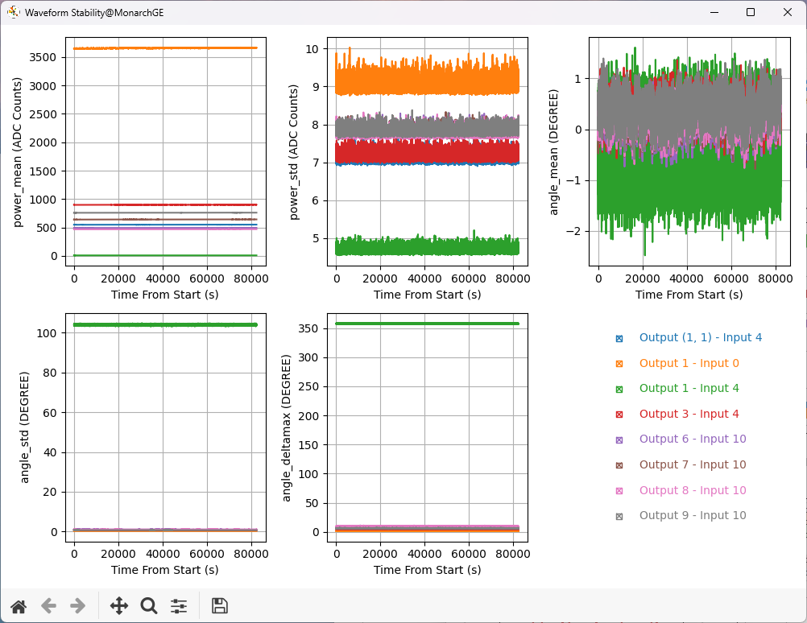
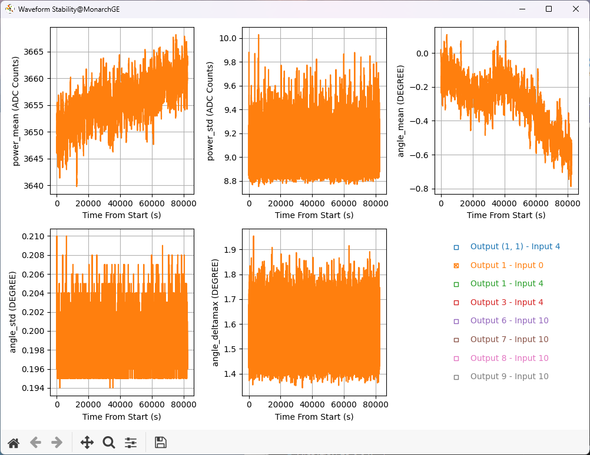
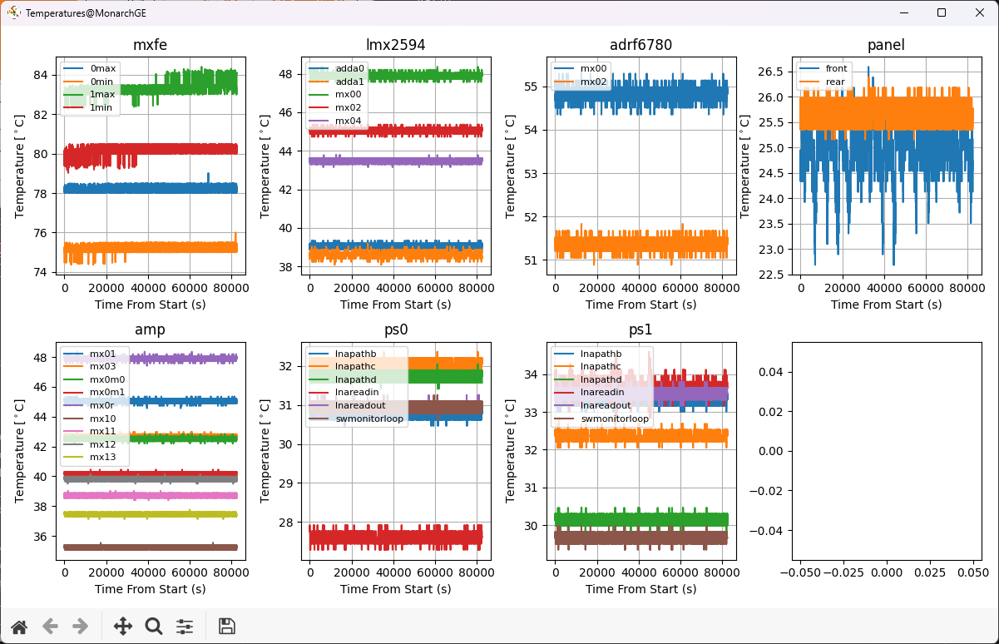
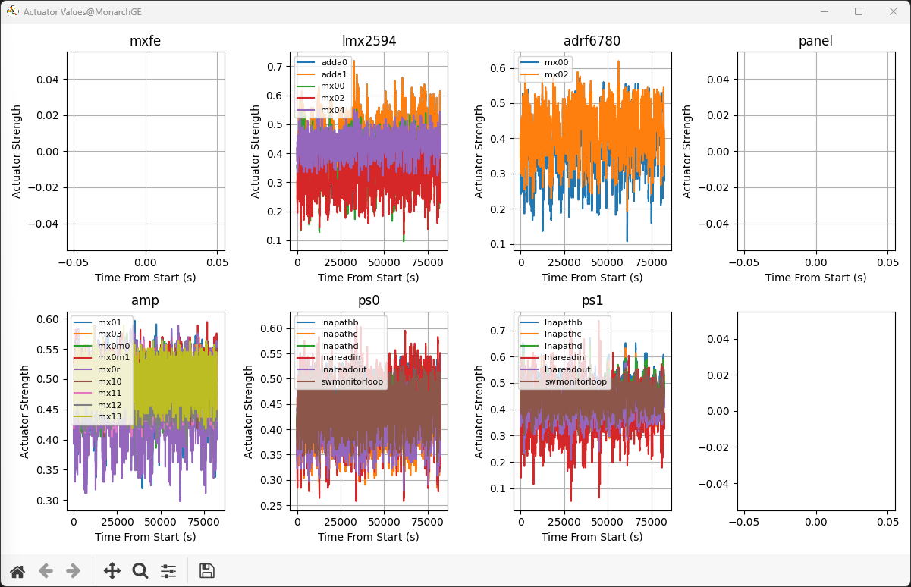

# 波形安定性測定スクリプトの使い方

## 概要

波形安定性測定スクリプト`quel1_stability_check`は，制御装置が出力するRF信号を自己監視し，振幅や位相などの波形情報を長時間記録するスクリプトである。
同時に，装置内の各部の温度情報も取得するので，波形情報と温度情報との突き合わせも可能である。
これらの情報は情報の種類ごとにCSVファイルに保存される。
これらのCSVファイルをオフライン分析すれば，波形の環境温度依存性などを詳らかできる。
記録途中のCSVファイルを，ビューワースクリプト`quel1_stability_viewer`を使い，リアルタイム監視できる。
また，後で説明するように，このビューワスクリプトは取得済みデータの可視化とオフライン分析の機能も提供する。

## 使用方法

ここでは具体的なスクリプトの実行方法を説明する。
装置のリンクアップは事前に行っておく必要がある。

### QuEL1SE(2-8 GHz)の場合

```shell
quel1_stability_check --ipaddr_wss 10.1.0.132 --ipaddr_css 10.5.0.132 --boxtype quel1se-riken8 --outdir /path/to/save/csv/files/ --duration 10000
```
オプション `--outdir` で出力CSVファイルの保存場所を，`--duration`で測定時間を秒単位で指定する。

### QuEL1の場合
```shell
quel1_stability_check --ipaddr_wss 10.1.0.58 --ipaddr_css 10.5.0.58 --boxtype quel1-a --outdir /path/to/save/csv/files/ --duration 10000 ----cmodhost 172.30.2.203 --sdb_port 36325 --hwsrv_port 6121 --cmod_jtag <JTAG_ID>
```
オプション `--outdir`，`--duration`に加えて温度情報を取得するためCMODに関連する以下のオプションを追加する。
これらのオプションを指定しない場合には，Warningを出力した上で波形情報だけの測定となる。

| オプション        | タイプ   | デフォルト値                       | 説明                           |
|-------------------|----------|------------------------------------|--------------------------------|
| `--cmod_host`     | `str`    | `"localhost"`                      | CmodがUSB接続されているホストのIPアドレス |
| `--xsdb_port`     | `int`    | 36335        　　　　　　　　　　　　| xsdbのポート |
| `--hwsvr_port`    | `int`    | 6121       　　　　　　　　　　　　　| hw_serverのポート |
| `--cmod_jtag`     | `str`    | 必ず指定する                        | Cmod USBアダプタのJTAG ID |

### その他オプション（QuEL1, QuEL1SE共通）

- `--skip_configs` : このオプションを追加すると測定条件の再設定を行わずに波形出力とキャプチャを開始する。このオプションはすでにリンクアップおよびNCOなどの設定済みの状態でそれらの設定を変えたくない場合に有効である。
- `--conf /path/to/user's/json` : このオプションにより，ユーザー定義のjsonファイルによりQuEL機体の設定が可能である。このオプションを省略するとデフォルトのjsonファイルが読み込まれる。jsonファイルのフォーマットは次章で述べる。 
- `--outports <comma seperated port list>` : このオプションで出力するポートを限定可能である。`--outports "1,(1,1),3"`のようにダブルクォーテーションで囲めば，サブポート番号を持つポートも指定可能である。指定しない場合はすべてのポートが出力される。
- `--boxname <custom name>` このオプションで指定される文字列`<custom name>`によりユーザー独自の名前を出力されるファイルに含めることができる。後半で説明するデータビューワーの使用時に、この`<custom name>`でファイルを指定することができる。

## 実験条件の設定

### 設定方法

実験条件の設定のデフォルトは[設定ファイルディレクトリ](src/quel_ic_config_cli/settings/)中のjsonファイルで記述される。:

|　ファイル名　|　BoxType 名 | 
|-------------|-------------|
|[wave_stability_quel1-a.json](../src/quel_ic_config_cli/settings/wave_stability_quel1-a.json)| que1-a, quel1se-fujitsu11-a |
|[wave_stability_quel1-b.json](../src/quel_ic_config_cli/settings/wave_stability_quel1-b.json)| que1-b, quel1se-fujitsu11-b |
|[wave_stability_quel1se-riken8.json](../src/quel_ic_config_cli/settings/wave_stability_quel1se-riken8.json)| que1se-riken8 |

上述の通り，オプション`--json /path/to/user's/json` でユーザー定義のjsonファイルで設定することも可能である。jsonファイルの書き方は以下を参照すること。

### 設定ファイルのフォーマット
この設定jsonファイルは"ports"というキーとそのキーに対応する値としてQuEL機体の各ポートの設定情報を含む。
QuEL機体の設定は，ポート番号とそのポートの設定内容とのキーバリューペアである。
設定内容の項目は以下のとおりである。

| 項目（キー）         | 説明                         | 型    | 備考                                                        |
|--------------|------------------------------|-------|-------------------------------------------------------------|
| `lo_freq`    | 局部発振器の周波数 [Hz]      | float |                                                             |
| `cnco_freq`  | CNCOの周波数 [Hz]| float |                                                             |
| `vatt`       | 可変減衰器の値               | int   | 0-4095まで                                                  |                                              
| `sideband`   | サイドバンドの種類           | str   | "L"か"U"のみ                                                |
| `rfswitch`   | RFスイッチの状態             | str   | dac（出力）は"block" か"pass"，adc（入力）は"loop"か"open" |

測定は，オプション`--outports`で指定された出力ポートに対して内部ループバックが可能な入出力ポートの組み合わせについて行われるが，
出力ポートの周波数に対して，入力側のミキサおよびMXFEでダウンコバートされた周波数が0になる組み合わせ以外は除外される。

なお，設定後にQuEL機体から実際に読み出した設定値がファイル名

"{オプション`--outdir`で指定したディレクトリ}/configs/configs_{ステージング番号}_{YYYYMMDDHHMMSS}.json"

に保存される。
これは入力設定ファイルと同じ形式で保存されるので，入力設定ファイルとしてオプション`--json`で指定可能である。最後の{YYYYMMDDHHMMSS}は同時に取得した波形データおよび温度データと同じになる。


## 出力CSVのフォーマット
### 波形データ

スクリプトの実行中に測定されたデータはCSVファイルに出力される。ファイル名は，

"{オプション`--outdir`で指定したディレクトリ}/wavestability/wavestability_{IPアドレス}_{YYYYMMDDHHMMSS}.csv"

である。ここで、{IPアドレス}はオプション`--ipaddr_wss`で指定したIPアドレスに対応する。
IPアドレスの`.`は`_`に変換される。例えば10.1.0.92を指定した場合、{IPアドレス}は10_1_0_92となる。
また、`--boxname`で文字列{カスタム名}を指定した場合、ファイル名は、

"{オプション`--outdir`で指定したディレクトリ}/wavestability/wavestability\_{カスタム名}\_{IPアドレス}\_{YYYYMMDDHHMMSS}.csv"

である。

波形データのCSVファイルは以下のフォーマットである。 数字は測定例であり，行数は(測定の回数) x (ポート数)となる。:
 
| time_from_start | output_port | input_port | power_mean |  power_std | angle_mean | angle_std | angle_deltamax |
|----------------:|------------:|-----------:|-----------:|-----------:|-----------:|----------:|---------------:|
|        5.44E-06 |           1 |          0 |   4483.696 |      8.861 |   -111.605 |     0.197 |          1.451 |

- `time_from_start`: 測定開始からの経過時間（秒）
- `output_port` :  出力ポート番号
- `input_port` :  入力ポート番号
- `power_mean`: 信号の平均パワー (ADC Counts)
- `power_std`: 信号のパワーの標準偏差 (ADC Counts)
- `angle_mean`: 信号の平均位相角度（度）
- `angle_std`: 信号の位相角度の標準偏差（度）
- `angle_deltamax`: 信号の位相角度の最大変動幅（度）

ここでいう平均，標準偏差および最大値は長さ100 usパルスに対応したキャプチャーデータに対しての値である。

### 温度データ

ファイル名は，

"{オプション`--outdir`で指定したディレクトリ}/tempctrl/tempctrl_{IPアドレス}_{YYYYMMDDHHMMSS}.csv"

である。ここで、{IPアドレス}はオプション`--ipaddr_wss`で指定したIPアドレスに対応する。
IPアドレスの`.`は`_`に変換される。例えば10.1.0.92を指定した場合、{IPアドレス}は10_1_0_92となる。
また、`--boxname`で文字列{カスタム名}を指定した場合、ファイル名は、

"{オプション`--outdir`で指定したディレクトリ}/tempctrl/tempctrl_{カスタム名}\_{IPアドレス}\_{YYYYMMDDHHMMSS}.csv"

である。

温調データのCSVファイルのフォーマットは以下の通りである。：

|   time_from_start |   location_name | temperature |  actuator_type |  actuator_val |
|------------------:|----------------:|------------:|---------------:|--------------:|
|          5.44E-06 |  adda_lmx2594_0 |        42.3 |            fan |           0.5 |

- `index` : 行番号
- `time_from_start`: 測定開始からの経過時間（秒）
- `location_name` : サーミスタの場所を表す文字列  
- `temperature` : サーミスタの温度
- `actuator_type`: 対応するアクチュエーターのタイプ。fan, heaterおよびpeltierがある。
- `actuator_val`: 対応するアクチュエーターの値

なお，QuEL1SEに関しては，サーミスタの数がアクチュエーターの数より多く，アクチュエーターの制御対象に入らないサーミスタが存在するため，
そのサーミスターに対応するactuator_typeとactuator_valが空欄になっている。

## ビューワスクリプト`quel1_stability_viewer`を用いた可視化

### 使用方法

これは取得したデータをグラフ化するスクリプトである。本スクリプトは20秒毎に指定したデータを読み込んでグラフを更新するので，リアルタイムモニタとしても使用可能である。
データの指定方法は主に２つあり、一つはQuEL機体を指定する方法、もう一つはデータファイルを直接指定する方法である。
まず、機体の指定は以下のようにIPアドレスかカスタム名で行う。

```shell
quel1_stability_viewer --ipaddr_wss 10.1.0.92 --boxtype quel1se-riken8 --data_dir /path/to/save/csv/files/
```

または、

```shell
quel1_stability_viewer --boxname test-box-1 --boxtype quel1se-riken8 --data_dir /path/to/save/csv/files/
```

である。このとき、オプション`--ipaddr_wss`と`--boxname`のうちどちらか一方に加えて、`--data_dir` でデータCSVファイルのディレクトリを指定する必要がある。
ここでは，上記データ取得スクリプト`quel1_stability_check`のオプション`--outdir`で指定したディレクトリを指定すること。
複数回の測定により同じ機体のデータCSVファイルが複数ある場合は、最新のものが表示される。
同時刻に測定した温度データが見つからない場合は Warningメッセージの後に波形データのみを表示する。

次にデータファイルを直接指定する場合は、以下のようにする。

```shell
quel1_stability_viewer --boxtype quel1se-riken8 --wave_csv /path/to/wavestability/csv/file
```

`--wave_csv`で波形データcsvファイルを直接指定する。
温度データファイルは指定せず、同じ測定回の温度データファイルが自動的に選択される。
具体的には、温度データcsvファイル名に含まれる時刻{YYYYMMDDHHMMSS}が波形データcsvファイル名のそれと同じものが選択される。
この場合も温度データがない場合には，Warningメッセージ後に波形データだけが出力される。

また，オプション `--freeze` を追加するとデータが追加されてもモニタが更新されない状態になる。
すでに取得が終了しているデータのグラフを見たい場合に使用するとよい。オプション`--freeze`では以下のようにターミナルに統計情報が表示される。
Stdは全測定データにおける標準偏差，Meanは全測定データにおける平均値，RatioはStd/Meanである。
上で定義しているように"angle_mean"と"angle_std"などの，"_mean"や"_std"は1パルス内（100us）の平均値や標準偏差を表しているのに対して，
ここで計算するMeanとStdは取得した全パルスに対しての平均値や標準偏差である。
```
Output 10 - Input 12
--------------------
Title           |        Std |       Mean |      Ratio
----------------+------------+------------+-----------
power_mean      |  39.752620 | 6133.532119 |   0.006481
power_std       |   0.113693 |  31.277498 |   0.003635
angle_mean      |   0.410841 |   0.267396 |        N/A
angle_std       |   0.127168 |   1.994015 |   0.063775
angle_deltamax  |   1.260279 |  13.399095 |   0.094057
-----------------------------+------------------------
```

実行後以下の波形，温度，アクチュエータ（ファン，ヒーター，ペルチェ）に関する３ウィンドウが表示される。

### 波形データウィンドウ



このウィンドウでは，各時刻に取得したパルス波形の平均パワー (ADC Counts)，パワーの標準偏差 (ADC Counts)，平均位相角度（度），位相角度の標準偏差（度），位相角度の最大変動幅（度）を時間の関数で表示している。
デフォルトではすべての出力ポートのデータを表示しておりデータ取得確認等に有用であろう。
特定のポートのデータを拡大して表示させたい場合は，右下のチェックボックスで注目したいポートを選択すると，以下のように選択したポートのデータに合わせてグラフの上下限が設定される。
なお，平均位相角度は測定直後の位相角度を0度として，そこからの差分を表示している。
これは，初期値が180（-180）度付近の場合に，わずかな変動で-180（180）度となってしまい，実際には大きくない変動が見かけ上大きく見えてしまうことを防ぐためである。



### 温度データウィンドウ



### アクチュエータウィンドウ


