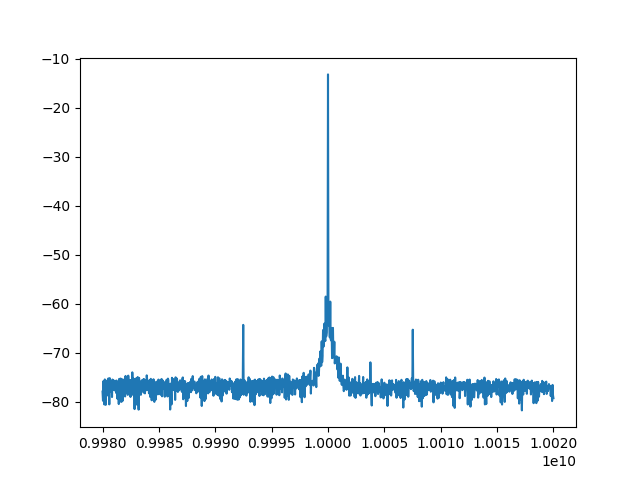

# 測定自動化ツール
E4405B, E4407B, MS2720Tをリモートから使用するためのツール。
MS2720Tのチュートリアルは[こちら](./MS2720T.ipynb)。

## インストール
Ubuntu20.04にインストールする手順を示す。

### GPIB
まず、E4405Bを使う場合には、KeySight社のIVIモジュールをインストールする必要がある。
ここから以下の2つのファイルをダウンロードしてインストールする。

- `iokerneldrivers-installer_20_0_26913_1.run`
- `iolibrariessuite-installer_20_0_26913_1.run`

1つ目がUSB-GPIBを使うためのカーネルモジュールのインストールスクリプトなので、先に実行する。
公式の手順どおりにやればできるが、ひとつ落とし穴がある。
`sudo -i` でルート権限のシェルに入り、そこで上記コマンドを実行しないと、CUIのダイアログ画面がうまく
表示されずに延々と待たされ続けることになるので注意が必要だ。

なお、カーネルモジュールのインストール時にUEFIのセキュアブートにフィンガープリントを登録するために、
新しいパスワードが必要になる。 このスクリプトの実行中に登録し、再起動後、BIOSの画面で入力する。
これは面倒くさいが、この山場さえ越えてしまえば、あとは簡単にことが進む。

2つめのインストーラもルート権限での実行が必要だが、ユーザランドのファイルのインストールなのですんなり
と進む。

### Qt5
次に、PC上にスペアナ画面を出すためのGUIで使用するライブラリをインストールする。
PyQt5 は quel_inst_tool のパッケージのインストールのときに、依存ライブラリとして自動に追加されるが、pipのバージョンが
古いとエラーが発生するので、確実に最新版にしておくこと。
```shell
sudo apt install python3-pyqt5
pip install -U pip
```
とすればよい。

### 本体
パッケージのビルドに `wheel`パッケージが必要なので、`pip install wheel`などとしておく。

ビルドは次のように行う。
```shell
rm -rf dist/
python setup.py bdist_wheel
```
すると、`dist`ディレクトリ以下にwhlパッケージができるので、それを`pip`などでインストールする。

たとえば、
```shell
pip install dist/quel_inst_tool-X.Y.Z-py3-none-any.whl
```
X,Y,Zには適切に置き換える必要がある。

## 使用例
たとえば、可能な限りのフレームレート（正確にはフレーム取得の時間 + 0.1秒毎に）で、10GHzを中心とした40MHz帯域を3kHzの分解能で1001点のデータを取得して、
画面の表示する引数は以下のとおり。
```
e4405b_cli --delay 0.1 --resolution 3e3 --points 1001 --freq_center=1e10 --freq_span 4e7 --peak -68
```

QuEL-1 で10GHzの信号を出したときに、上記のコマンドを実行すると、下のような感じの画面が6秒おきくらいに更新される。


最後の `--peak -68`は、コンソール上に -68dBより大きいピークをダンプすることの指定をしている。
こんなかんじで、雑にピークの周波数と強度が表示される。
```shell
$ e4405b_cli --delay 0.1 --points 401 --resolution 3e3 --points 1001 --freq_center=1e10 --freq_span 4e7 --peak -68
2023-06-14 20:33:08,815 [INFO] quel_inst_tool.e4405b: a resource 'GPIB0::18::INSTR' is recognized.
2023-06-14 20:33:08,816 [INFO] quel_inst_tool.e4405b: a resource 'GPIB0::6::INSTR' is ignored because it is blacklisted.
2023-06-14 20:33:08,990 [INFO] main: wainting for 0.100000 seconds...
2023-06-14 20:33:09,239 [INFO] main: center_freq = 10000000000.0, freq_span = 40000000.0, resolution = 3000.0, sweep_points = 1001
2023-06-14 20:33:09,363 [INFO] main: average_enable, average_count = False, 100
2023-06-14 20:33:09,527 [INFO] quel_inst_tool.e4405b: waiting for capture...
2023-06-14 20:33:15,488 [INFO] quel_inst_tool.e4405b: capture completed
2023-06-14 20:33:15,648 [INFO] main: [[ 1.00000000e+10 -1.33290005e+01]
 [ 9.99248000e+09 -6.52269974e+01]
 [ 1.00075200e+10 -6.55810013e+01]]
2023-06-14 20:33:15,755 [INFO] main: push Q to update.
2023-06-14 20:33:15,755 [INFO] main: push Ctrl+C to quit.
libGL error: No matching fbConfigs or visuals found
libGL error: failed to load driver: swrast
2023-06-14 20:33:17,551 [INFO] quel_inst_tool.e4405b: waiting for capture...
2023-06-14 20:33:23,439 [INFO] quel_inst_tool.e4405b: capture completed
2023-06-14 20:33:23,574 [INFO] main: [[ 1.00000000e+10 -1.33470001e+01]
 [ 9.99248000e+09 -6.39109993e+01]
 [ 1.00004400e+10 -6.45879974e+01]
 [ 1.00075200e+10 -6.47580032e+01]]
2023-06-14 20:33:23,824 [INFO] quel_inst_tool.e4405b: waiting for capture...
2023-06-14 20:33:29,880 [INFO] quel_inst_tool.e4405b: capture completed
2023-06-14 20:33:30,031 [INFO] main: [[ 1.00000000e+10 -1.34410000e+01]
 [ 1.00002000e+10 -5.97420006e+01]
 [ 9.99980000e+09 -6.07330017e+01]
 [ 1.00075200e+10 -6.43840027e+01]
 [ 9.99248000e+09 -6.54769974e+01]]
2023-06-14 20:33:30,296 [INFO] quel_inst_tool.e4405b: waiting for capture...
2023-06-14 20:33:36,229 [INFO] quel_inst_tool.e4405b: capture completed
2023-06-14 20:33:36,381 [INFO] main: [[ 1.00000000e+10 -1.34860001e+01]
 [ 9.99980000e+09 -6.10670013e+01]
 [ 1.00003200e+10 -6.10680008e+01]
 [ 1.00002000e+10 -6.12910004e+01]
 [ 9.99248000e+09 -6.44629974e+01]
 [ 1.00075200e+10 -6.60309982e+01]]

```
## MS2720TとE440xBの違いについて

上記cliはまだないが，MS2720Tに関してもAPIがある。現時点でのE440xBとの違いを述べる。

### TRACEモード

TRACEモードがMAXHOLDとMINHOLDのとき，E440xBではTRACEモードを設定してからTRACEを取得するまでのMAX(MIN)値をとるようになっている。一方で，MS2720Tでは別のパラメタholdmode_nsweepsの設定値の回数だけsweepを行い，そのsweep回数の中でのMAX(MIN)値をとる。また，MS2720Tでは，TRACEモードに平均（AVER）が選択でき，この場合はパラメタaverage_count分のsweep数のアベレージとなる。一方，E440xBではアベレージカウントの設定が上手く行っておらず今後修正したい。

### SWEEP点数

SWEEP点数がMS2720Tは551固定のため，設定しようとするとValueErrorを返す。

### Peak値取得

MS2720Tではpeak_threshold（default 10 %）で設定したピーク定義のピーク値情報をすべて取得できる。
