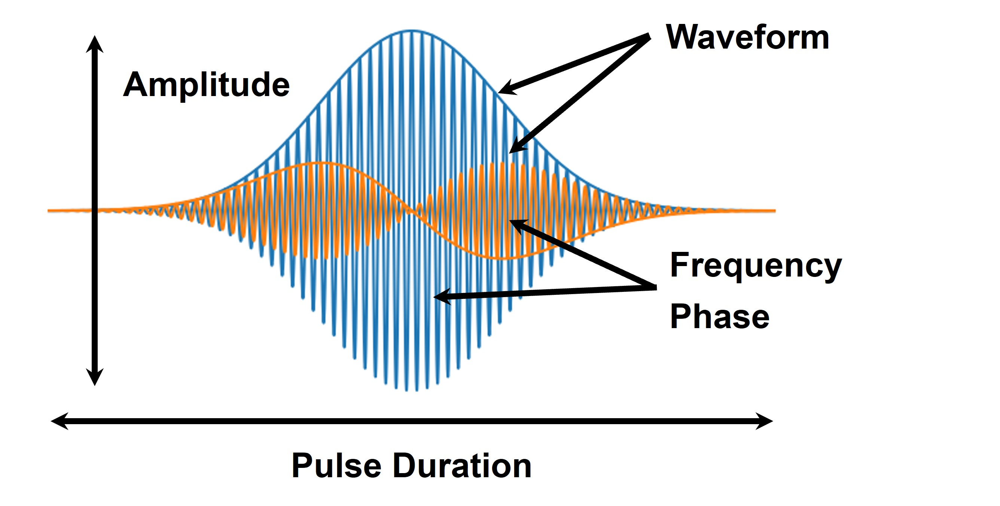

# 0章: 制御装置を使ってみる

量子ビット制御装置の基本的な使い方を解説します。
信号生成とループバック機能およびモニタ機能を用いたその信号観測のデモを通して、装置の操作方法を学びます。

## ファイル一覧

| **モデル**              | **関連ファイル**             | **説明**                             |
|---------------------------|-----------------------------|--------------------------------------|
| **QuEL-1 Type-A**               | [`quel1.ipynb`](./quel1.ipynb)              | チュートリアル用 Jupyter notebook ファイル |
|                           | [`port_config_quel1.json`](./port_config_quel1.json)   | ポート設定情報                       |
| **QuEL-1 SE 2-8 GHz モデル** | [`quel1se8.ipynb`](./quel1se8.ipynb)           | チュートリアル用 Jupyter notebook ファイル |
|                           | [`port_config_quel1se8.json`](./port_config_quel1se8.json)| ポート設定情報                       |
| **QuEL-1 SE 7-11 GHz モデル Type-A** | [`quel1se11.ipynb`](./quel1se11.ipynb)          | チュートリアル用 Jupyter notebook ファイル |
|                           | [`port_config_quel1se11.json`](./port_config_quel1se11.json)| ポート設定情報                      |

[`common`](./common/) には、チュートリアルの実行に必要な補助関数を含む Python モジュールが格納されています。

## はじめに

超伝導量子ビットを用いた量子情報処理の実験では、実験者が望むマイクロ波パルスを生成し、量子ビットや読み出し共振器を駆動する必要があります。
これらのパルスは、以下の図に示すような多様なパラメータが関与しています。
高精度な量子ビットの制御を実現するためには、これらのパラメータを適切に設定することが重要です。

量子ビット制御装置は、ユーザーが所望のマイクロ波パルスを容易に生成することを可能にし、効率的な量子実験の実行をサポートします。

### **本チュートリアルの目的**

本チュートリアルでは、制御装置の基本的な使用法について学びます。
装置の操作方法を、信号生成とループバックおよびモニタ機能を用いた信号観測のデモを通して学びます。
**なお本チュートリアルでは、実際の量子ビットを使用せず、制御装置単体のみを使用して実行するサンプルコードになります。**
実際の量子ビットを用いた量子実験は、後続のチュートリアルで取り扱います。

## チュートリアルの実行

それでは、制御装置を動かしてみましょう。
使用するモデルに対応した資料を開いてください。

- [`quel1.ipynb`](./quel1.ipynb): QuEL-1 用のチュートリアル
- [`quel1se8.ipynb`](./quel1se8.ipynb): QuEL-1 SE 2-8 GHz モデル用のチュートリアル
- [`quel1se11.ipynb`](./quel1se11.ipynb): QuEL-1 SE 7-11 GHz モデル用のチュートリアル

