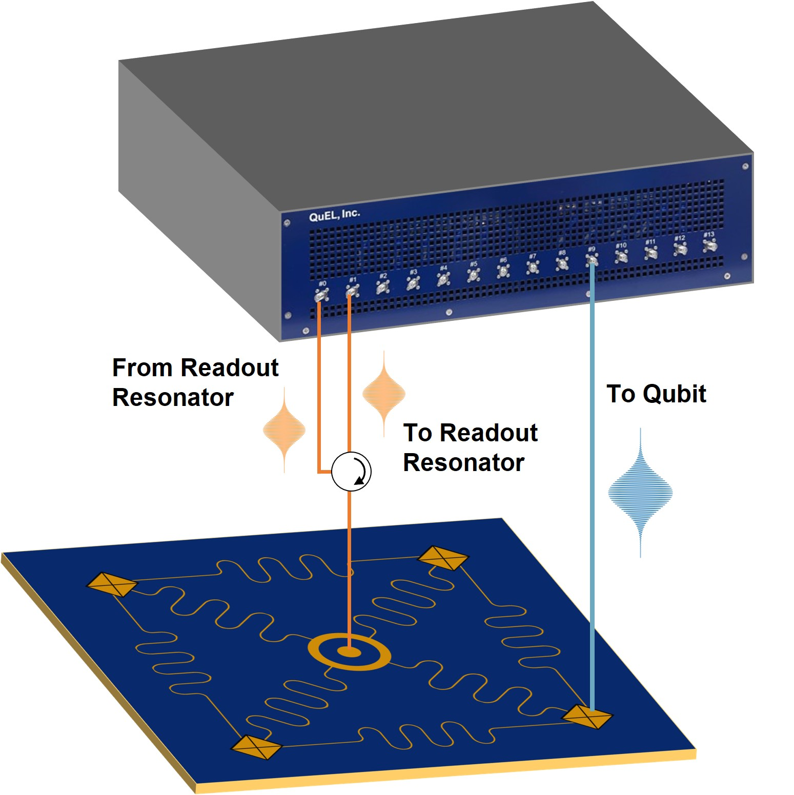

# 1章: Rabi 振動の観測

制御装置を用いて、単一超伝導量子ビットの Rabi 振動観測を行います。

## ファイル一覧

| **モデル**              | **関連ファイル**             | **説明**                             |
|---------------------------|-----------------------------|--------------------------------------|
| **QuEL-1 Type-A** | [`quel1.ipynb`](./quel1.ipynb) | チュートリアル用 Jupyter notebook ファイル |

[`common`](./common/) には、チュートリアルの実行に必要な補助関数を含む Python モジュールが格納されています。

## はじめに

### **本チュートリアルの目的**

本チュートリアルでは、制御装置を用いた Rabi 振動観測デモを紹介します。
基本的な量子実験である、Rabi 振動観測実験を通じて、制御装置の操作方法の理解を深めます。

### **前提**

本チュートリアルでは、制御装置を用いて超伝導量子ビットのRabi振動の結果を得る手順を説明します。
前提として、超伝導量子ビットと読み出し共振器のそれぞれの共振周波数が、CW 測定などを通じて既知であるとします。
チュートリアル中のコードには仮の共振周波数を埋めてあるので、実際の周波数で上書きしてください。
また、量子ビットの測定方法として、積算測定を想定します。

### **セットアップ**

本チュートリアルでは、単一の超伝導量子ビットにおける Rabi 振動の観測を想定します。
以下の図に示すように、単一の制御ポートと読み出し用の送受信ポートを使用します。
なお、配線は使用する制御装置のモデルに合わせて適宜変更してください。

## **チュートリアルの実行**

それでは、制御装置を動かしてみましょう。
使用するモデルに対応した資料を開いてください。

- [`quel1.ipynb`](./quel1.ipynb): QuEL-1 用のチュートリアル
