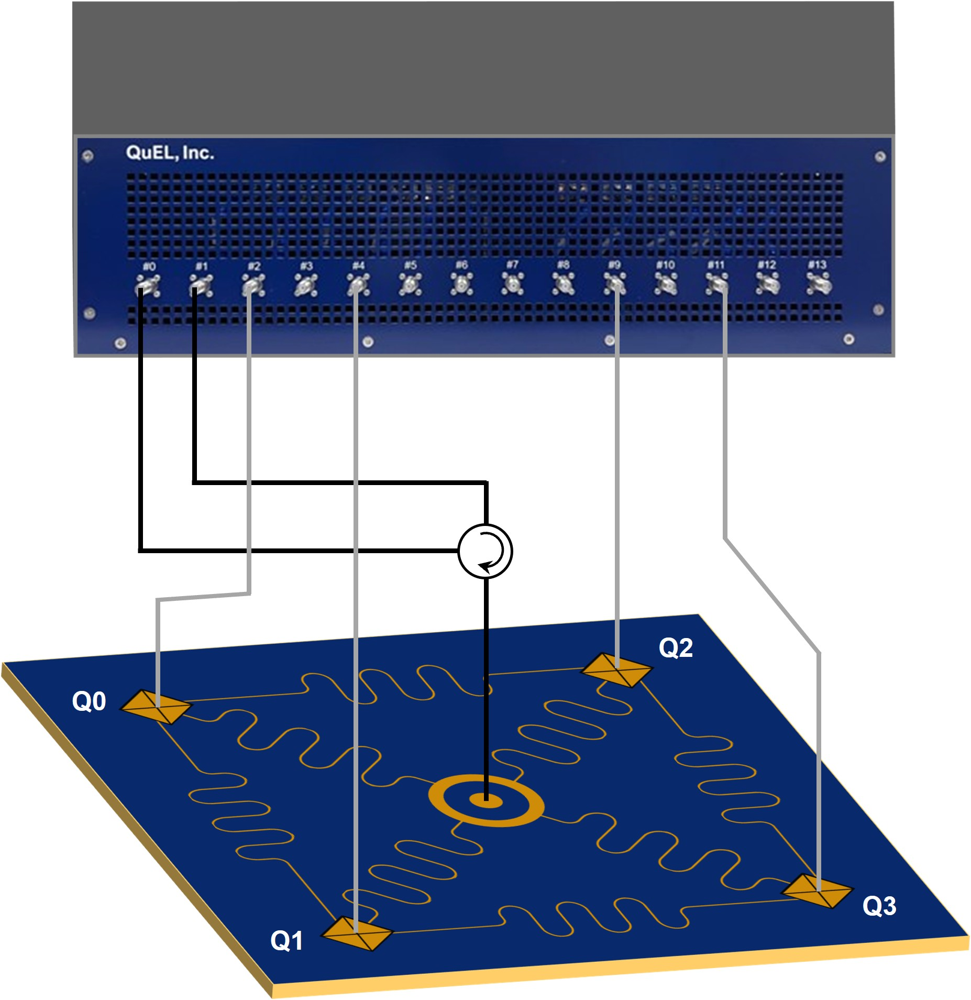

# 2章: 複数量子ビットの Rabi 振動の観測

制御装置を用いて、複数超伝導量子ビットの Rabi 振動観測を行います。

## ファイル一覧

| **モデル**              | **関連ファイル**             | **説明**                             |
|---------------------------|-----------------------------|--------------------------------------|
| **QuEL-1 Type-A** | [`quel1.ipynb`](./quel1.ipynb) | チュートリアル用 Jupyter notebook ファイル |

- [`common`](./common/): チュートリアルの実行に必要な補助関数を含む Python モジュールが格納されています。
- [`qubit_params.json`](./qubit_params.json): 量子ビット制御に必要なパラメタ情報が記載されたファイルです。

## はじめに

本チュートリアルでは、制御装置を用いた複数量子ビットの Rabi 振動観測デモを紹介します。
前提として、超伝導量子ビットと読み出し共振器のそれぞれの共振周波数が、CW 測定などを通じて既知であるとします。
[`qubit_params.json`](./qubit_params.json) に仮の共振周波数を埋めてあるので、実際の周波数で上書きしてください。
また、量子ビットの測定方法として積算測定を使用します。

### セットアップ

本チュートリアルでは、複数の超伝導量子ビットにおける Rabi 振動の観測を想定します。
実験のセットアップとしては、以下の図に示すような、配線を想定します。
ただし、配線は使用する制御装置のモデルに合わせて適宜変更してください。

## チュートリアルの実行

それでは、制御装置を動かしてみましょう。
使用するモデルに対応した資料を開いてください。

- [`quel1.ipynb`](./quel1.ipynb): QuEL-1 用のチュートリアル
