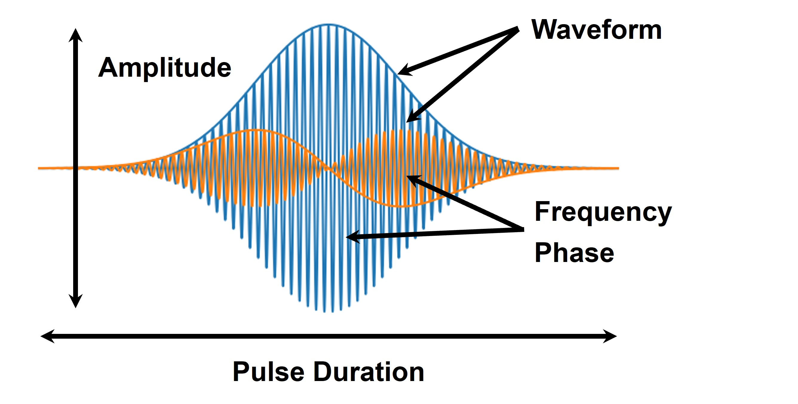

# 0章: QuEL-1 を使ってみる

量子ビット制御装置 QuEL-1 の基本的な使い方を解説します。
QuEL-1 を用いた信号生成とループバック機能およびモニタ機能を用いたその信号観測のデモを通して、装置の操作方法を学びます。

## ファイル一覧

- [`0_Setup.ipynb`](./0_Setup.ipynb): メインのチュートリアル資料
- [`qexp_func.py`](./qexp_func.py): チュートリアルの実行に必要な補助関数を含む Python モジュール
- [`port_config.json`](./port_config.json): QuEL-1 の各ポートの設定情報が記載されたファイル

## はじめに

超伝導量子ビットを用いた量子情報処理の実験では、実験者が望むマイクロ波パルスを生成し、量子ビットや読み出し共振器を駆動する必要があります。
これらのパルスは、以下の図に示すような多様なパラメータが関与しています。
高精度な量子ビットの制御を実現するためには、これらのパラメータを適切に設定することが重要です。

量子ビット制御装置 QuEL-1 は、ユーザーが所望のマイクロ波パルスを容易に生成することを可能にし、効率的な量子実験の実行をサポートします。

### **本チュートリアルの目的**

本チュートリアルでは、QuEL-1の基本的な使用法について学びます。
装置の操作方法を、信号生成とループバックおよびモニタ機能を用いた信号観測のデモを通して学びます。
**なお本チュートリアルでは、実際の量子ビットを使用せず、QuEL-1 単体のみを使用して実行するサンプルコードになります。**
実際の量子ビットを用いた量子実験は、後続のチュートリアルで取り扱います。

### **前提**

本チュートリアルは、`QuEL-1 Type-A` の使用を前提としています。
サンプルコードの理解には、`QuEL-1 Type-A` の入力・出力ポートに関する知識が必要となります。
`QuEL-1 Type-A` の入力・出力ポート情報については、[quel1.md](../quel1.md)を参照してください。
また、詳しいポートの説明や、各機能については、納品時にお渡ししている取り扱い説明書を参照してください。

## チュートリアルの実行

それでは、[`0_Setup.ipynb`](./0_Setup.ipynb) を開いて QuEL-1 を動かしてみましょう。
