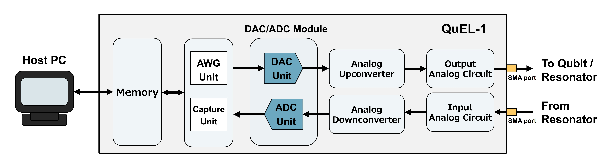
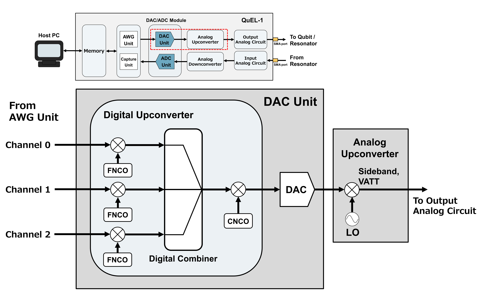
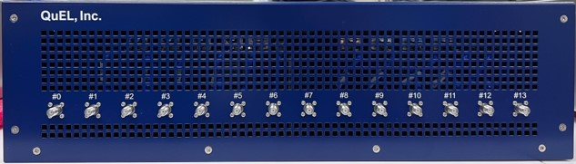

# 量子ビット制御装置 QuEL-1

`QuEL-1 Type-A` の内部構成と入力・出力ポートについて簡単に整理を行います。
詳しいポートの説明や、各機能については、納品時にお渡ししている取り扱い説明書を参照してください。

## QuEL-1 の全体構成

QuEL-1 の波形生成と取得に関わる主要なブロックを下図に示します。

各ブロックの概要は以下のとおりです。

| コンポーネント | 説明 |
|----------------------------------------|-----------------------------------------|
| Host PC | 実験制御と波形データの生成を担います。 |
| メモリ  | 波形データを一時的に保持します。 |
| AWG ユニット | メモリから波形データを取得・加工して、DACモジュールに供給します。 |
| キャプチャユニット | 取得したデータに信号処理を施し、メモリに書き出します。 |
| DAC/ADC モジュール | DAC および ADC を搭載しています。|
| アナログアップコンバータ | DAC が出力する IF 信号 (0.7-3.5 GHz) を RF 信号 (7-11 GHz) へ周波数変換します。 |
| アナログダウンコンバータ | 入力 RF 信号 (7-11 GHz) をADCが変換できる周波数帯 (0.8-2.8 GHz) に周波数変換します。 |
| 入力・出力アナログ回路   | フィルタ、スイッチ、ローノイズアンプなどから成り、上述の各コンバータとフロントパネルのSMAポートを繋いでいます。フィルタの有無や帯域については後半の記述を参照してください。また、[0章](./0_Setup)のデモで使用する、ループバックスイッチも含みます。このスイッチは、アナログアップコンバータの出力をSMAポートに通すか、あるいは、アナログダウンコンバータへ入力するかの切り替えをします。ループバック経路を使用中は SMAポートからの出力が得られないので、量子ビットを使った実験をするときには注意が必要です。 |
| モニタ用アナログ回路 | 上図には示されていませんが、信号のモニタ機能に用いられる回路です。出力アナログ回路から方向性結合器を介して信号を分岐し、受信部へと信号を取り込む役割を果たします。こちらも、[0章](./0_Setup)の後半で行うモニタ機能を用いた信号観測デモで使用します。                                |

## QuEL-1 の動作プロセス

QuEL-1 は、以下のように動作し、信号生成・受信および処理を行います。

### 信号生成
量子ビットや読み出し共振器の駆動に用いるマイクロ波パルスの生成プロセスは以下のとおりです。
- Host PC が、QuEL-1 内部のメモリに生成したい信号のベースバンド信号となる IQ 波形データを転送します。
- 装置内の AWG ユニットが、内部メモリから波形データを取り出し、デジタルアップコンバータと DAC からなる DAC ユニットに供給します。
- DAC ユニットが波形データをアナログ信号に変換し、アナログアップコンバータが必要な周波数にアップコンバートします。
- アップコンバートされたアナログ信号は、様々なアナログコンポーネントを通じて最終的に SMA ポート から出力されます。

### 信号受信
量子ビットの読み出し信号の処理プロセスは以下のとおりです。
- 読み出し信号は、SMA ポートから取り込まれ、アナログダウンコンバータでダウンコンバートされます。
- ADC ユニットが、アナログ信号をデジタル変換および、デジタルダウンコンバートをします。
- AWG ユニット内のキャプチャユニットが、デジタル信号に信号処理を施し、内部のメモリにデータを書き出します。

## QuEL-1 における信号生成の理解

QuEL-1 におけるマイクロ波信号生成方式を説明する目的で、先程のブロック図のDAC及びアナログアップコンバータの詳細を下図に示します。

1つの DAC ユニットは複数の AWG ユニットから波形データを同時入力可能です。
DAC ユニットは、複数の入力をデジタル的に合波した上でアナログ波形に変換します。
この際に、DAC ユニット内部のいくつかの数値制御発振器 (FNCO, CNCO)を用いて、デジタル周波数変換が可能です。
ユーザがメモリを介して AWG に供給する波形データは 500 Msps の IQ データなので、帯域 500 MHz のアナログ波形に相当します。
この単位をチャネルと呼びます。
QuEL-1 の制御信号用のポートの一部は、このチャネルが複数割り当てられています。
上図においては、3 個のチャネルが割り当てられている場合を想定しており、AWG と FNCO が三組存在しています。

一段目のデジタルミキサにて、各チャネルを独立に -1 GHzから 1 GHz の範囲にデジタル的に移調できます。
それらをデジタルコンバイナでデジタル的に合波した後に、さらに後段のデジタルミキサで、0 GHz から 6.0 GHz の範囲に移調できます。
実際には、DAC ユニット内部のデジタルフィルタの肩の特性や、DAC の後ろにあるアナログミキサの入力可能帯域の制限で、実用的な範囲は制限されます。
これについては、後述の具体例にて説明します。
その後、DAC ユニットからアナログ信号として出力され、後段のアナログミキサにて、アナログアップコンバートされ、アナログ回路へと送信されます。

この信号生成の過程において、所望のマイクロ波パルスを生成するために、各コンポーネントにおいて様々なパラメータを設定します。
以下に、QuELL-1 の信号生成において必要なパラメータ類を表にまとめます。

| ユニット | コンポーネント | パラメータ/入力データ | 説明 |
| :---- | :--- | :--- | :--- |
| AWG ユニット | | 波形データ (IQ データ) | ベースバンド信号 |
| DAC ユニット | デジタルアップコンバータ | FNCO | 細デジタルアップコンバータに入力する NCO の出力周波数 |
| | | CNCO | 粗デジタルアップコンバータに入力する NCO の出力周波数 |
| | DAC | Full Scale Current | DACの出力強度を規定する電流値 (QuEL-1 では 40527 uA) |
| アナログアップコンバータ | LO | LO | アナログミキサに入力する LO 信号の周波数 |
| | アナログミキサ | Sideband | ミキサ出力のサイドバンドの選択   `U`: 出力周波数は $f_{LO} + (f_{FNCO} + f_{CNCO})$   `L`: 出力周波数は $f_{LO} - (f_{FNCO} + f_{CNCO})$ |
| | | VATT | アナログミキサに内蔵された可変アッテネータの設定値 |
| アナログ回路 | RF Switch | ON / OFF | 信号入力の通過・遮断の制御。外部入力を遮断することで、ループバック機能を有効にします。 |

これらのパラメータの具体的な設定方法については、[0章](./0_Setup)で詳しく取り扱います。
また、各パラメータのさらに詳細な説明は[こちらのドキュメント](https://github.com/quel-inc/quelware/blob/main/reference_manuals/Quel1seRiken8ReferenceManual.md)を参照してください。

## QuEL-1 の入力・出力ポート

`QuEL-1 Type-A` の入力・出力ポートについて簡単に整理を行います。
以下の写真は、QuEL-1 Type-A のフロントパネルになります。

合計で 14 個の SMA ポートが備わっています。
これらの各ポートに関する情報をまとめたのが以下の表です。

| ポート番号 | 名称   | 方向性 | 機能 | フィルタの帯域 |
|------------|--------|--------|--------|--------|
| #0 | Read-in | 入力 | 観測信号入力ポート | 9.5-11 GHz |
| #1 | Read-out | 出力 | 観測信号出力ポート | 9.5-11 GHz |
| #2 | Ctrl | 出力 | 制御信号出力ポート | 7.0-10.0 GHz |
| #3 | Pump | 出力 | ポンプ信号出力ポート | 19-22 GHz |
| #4 | Ctrl | 出力 | 制御信号出力ポート | 7.0-10.0 GHz |
| #5 | Monitor-in | 入力 | 信号のモニタ用ポート ポート#1, #2, #3, #4の信号モニタ出力を装置内ループバック監視用のADCへ接続しています。装置内ループバック使用時には外部から信号を受け付けられません。 | N.A. |
| #6 | Monitor-out | 出力 | ポート#1, #2, #3, #4の信号モニタ出力を外部に取り出すのに使用します。モニタ出力を装置内ループバック監視する場合には、ポートへの出力はできません。 | N.A. |
| #7 | Read-in | 入力 | 観測信号入力ポート | 9.5-11 GHz |
| #8 | Read-out | 出力 | 観測信号出力ポート | 9.5-11 GHz |
| #9 | Ctrl | 出力 | 制御信号出力ポート | 7.0-10.0 GHz |
| #10 | Pump | 出力 | ポンプ信号出力ポート | 19-22 GHz |
| #11 | Ctrl | 出力 | 制御信号出力ポート | 7.0-10.0 GHz |
| #12 | Monitor-in | 入力 | 信号のモニタ用ポート ポート#8, #9, #10, #11の信号モニタ出力を装置内ループバック監視用のADCへ接続しています。装置内ループバック使用時には外部から信号を受け付けられません。 | N.A. |
| #13 | Monitor-out | 出力 | ポート#8, #9, #10, #11の信号モニタ出力を外部に取り出すのに使用します。モニタ出力を装置内ループバック監視する場合には、ポートへの出力はできません。 | N.A. |

