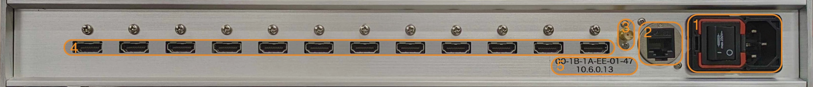

# QuEL-1/QuEL-1 SE用 クロック分配器 取扱説明書
「クロック分配器」は、キュエル社製量子コンピュータ制御装置 QuEL-1 及び QuEL-1 SE にクロック信号を供給する装置です。
複数の制御装置に同期したクロック信号を供給することで、ひとつの量子コンピュータ制御システムとしての連携動作を可能にします。

クロック分配器には親機と子機の2種類があり、親機はクロック源を内蔵しています。
親機は12台の制御装置に互いに同期したクロック信号を供給可能です。
子機はクロック源を持たず、親機の出力ポートから入力したクロック信号を自身の12個の出力ポートから分配します。
現状では、子機のクロック入力端子を親機の出力端子につなぐ、いわゆる、1段のカスケード接続だけを動作保証範囲としております。
したがって、ひとつのシステムでは12個の子機が使用可能で、最大144台の制御装置を同期動作させることができます。

クロック分配器が供給するクロック信号は、250MHz、100MHz、及び 62.5kHzの3種類を含みます。
一番遅いクロック周期である16msの半分未満の精度でシステム全体が時刻共有できれば、一番早い250MHzのクロック単位に近い精度での装置間の時刻同期が可能になります。
このシステム全体での時刻共有の機能はクロック分配器ではなく、[クロックマスタ](./ClockmasterReferenceManual.md)が提供します。

## 外観
### 親機

|      図中番号      | 名称            | 概要                                                                |
|:--------------:|---------------|-------------------------------------------------------------------|
| &nbsp;1&nbsp;  | AC電源インレット     | 100VACの商用電源に接続します。電源投入用のスイッチとヒューズボックスが付いています。                     | 
|       2        | 監視用RJ45端子     | GbEを介してホストPCと接続して、主に稼働状態を監視するのに用います。                              |
|       3        | 参照信号入力SMA端子   | ルビジウムクロックなどから10MHzの超高精度クロックを入力します。入力がない場合には内蔵のOCXOを周波数補正無しで使用します。 |
|       4        | 制御装置用クロック出力端子 | HDMIケーブルを介して制御装置へクロックを供給します。12個の端子があります。                          |
|       5        | 個体情報シール       | IPアドレスやMACアドレスなどの個体情報が記載してあります。                                   |

親機はクロック源として100MHzのOCXOを内蔵しています。
このOCXO単体でのクロック偏差は最悪値で100ppbですが、さらに高精度な外部クロック源から10MHzのクロック信号を参照信号入力SMA端子に与えることで、OCXOの周波数偏差を補償できます。
たとえば、[FS-725](https://www.thinksrs.com/products/fs725.html)を接続することで、ppbオーダーでの周波数精度が得られます。 

### 子機

|      図中番号      | 名称            | 概要                                                                  |
|:--------------:|---------------|---------------------------------------------------------------------|
| &nbsp;1&nbsp;  | AC電源インレット     | 100VACの商用電源に接続します。電源投入用のスイッチとヒューズボックスが付いています。                       | 
|       2        | 監視用RJ45端子     | GbEを介してホストPCと接続して、主に稼働状態を監視するのに用います。                                |
|       3        | クロック入力端子      | HDMIケーブルを介して、親機の制御装置用クロック出力端子と接続して使います。子機はクロック源を内蔵しないので、動作に接続が必要です。 |
|       4        | 制御装置用クロック出力端子 | HDMIケーブルを介して制御装置へクロックを供給します。12個の端子があります。                            | 
|       5        | 個体情報シール       | IPアドレスやMACアドレスなどの個体情報が記載してあります。                                     |

子機はクロック源を内蔵しないので、親機のクロック出力端子を子機のクロック入力端子に接続して使用します。
子機も12ポートのクロック出力を持っているので、親機の1ポートを12分岐します。

## 使用方法
電源投入後10秒ほどで、安定したクロックの供給が始まります。
制御装置は不安的なクロック信号の元では正常に起動しないので、制御装置の電源投入はクロック分配器の電源投入10秒以上経ってからにしてください。
なお、稼働中のクロック分配器のクロック出力端子にHDMIケーブルを挿抜するのは問題ありません。

参照信号は電源投入前に接続してください。
電源投入直後に参照信号の有無の確認を行い、正常な参照信号が検出できなかった場合には、入力を遮断します。

### 補足
クロック分配器の監視用ホスト側ソフトウェアの開発ができておりません。
こちらは開発まで少々お待ちください。
親機については、ハートビートカウンタなどの他に、ルビジウムクロックに対する周波数偏差の統計情報などが得られます。
