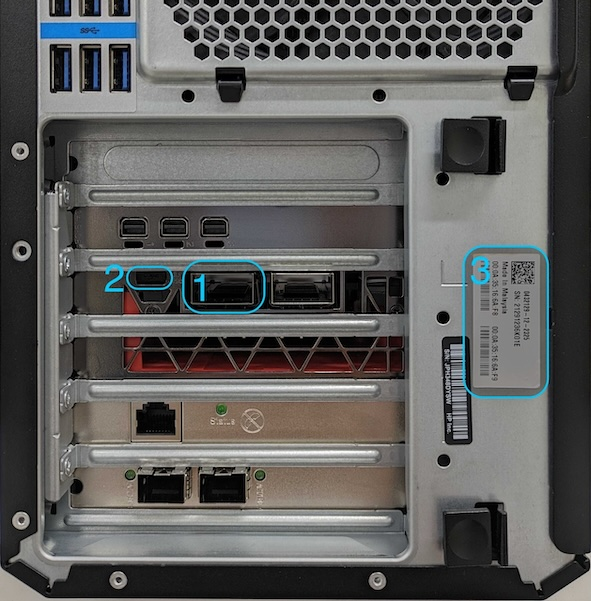

# QuEL-1/QuEL-1 SE用 クロックマスタ 取扱説明書
「クロックマスタ」は複数のキュエル社製制御装置 (QuEL-1, 及び QuEL-1 SE) が構成する量子コンピュータ制御システムにおける時刻の配布を担当します。
厳密に言えば、クロックマスタは一時点における装置間の時刻共有を行いますが、時刻共有状態の維持には関与しません。
つまり、互いに同期したクロックで駆動されている複数の制御装置に対してクロックマスタを適用することで、複数の制御装置をひとつの制御システムに統合する基盤を構築できます。
なお、同期クロックの複数装置への供給は[クロック分配器](./ClockdistReferenceManual.md)が担当します。

クロックマスタの物理的実体は、制御用PCのPCIeスロットに挿してある[Xilinx Alveo U200](https://japan.xilinx.com/products/boards-and-kits/alveo/u200.html)です。
Alveo U200の100GbEネットワークインターフェースから分岐した10GbEネットワークインターフェースを介して、内部に保持しているカウンタ値を各制御装置に配ります。
IEEE 1588と類似のプロトコルを用いて通信遅延を考慮したカウンタ値の配布が行われるので、制御装置間の数マイクロ秒以下の精度での時刻合わせを実現します。

## 外観・接続法
PCのPCIeスロットにインストールしたAlveo U200をPCの背面から見た写真です。

</img>

|        図中番号         | 名称                   | 概要                                                                                                                                     |
|:-------------------:|----------------------|----------------------------------------------------------------------------------------------------------------------------------------|
| &nbsp;&nbsp;1&nbsp; | QSFPポート              | QSFPスプリッタケーブルを介して、分岐した4系統のうちの2系統をネットワークハブの10GbEのポートに接続します。                                                                             | 
| &nbsp;&nbsp;2&nbsp; | ファームウェア<br>プログラミング端子 | ファームウェアアップデート時にmicroUSBケーブルでPCに接続します。必要ないときには何も接続しないでください。                                                                             |
| &nbsp;&nbsp;3&nbsp; | 個体情報シール              | Alveo U200に割り当てられたMACアドレスとJTAGアダプタのIDが記載されています。2023年度3月25日以降の納品PCに貼ってあります。それ以前のものについては、QuEL社にお問い合わせください。あるいは、Alveo U200本体のシールをご参照ください。 |

Alveo U200は2つのQSFPポートを備えており、このうちの1つを使用します。
PC背面から見たときに向かって左側のインターフェースにQSFPスプリッタケーブルを挿して4分岐した10GbEインタフェースのうち、2つ (A系統・B系統) を使用します。
A系統とB系統のそれぞれを、同じ系統の10GbEネットワークハブに接続して使用します。
つまり、クロックマスタの各系統のケーブルと制御装置の各系統の10GbEケーブルとが、同じハブに挿さる状態にしてください。

Alveo U200はPCIeコネクタとは別に補助の電源用コネクタ (ファン・6pin・8pin) を持ちます。
クロックマスタの回路の消費電力は小さいので、Alveo U200が要求するPCIe x16ポートに挿している場合には、補助電源コネクタの接続は必要ありません。
一方で、クロックマスタはPCIe を介したデータ転送を一切行わないので、PCIe x1ポートに挿しても使用することも可能です。
その場合にはPCIeポートからの電源供給が足りないので、補助電源コネクタを接続してください。

## 時刻同期の手順
[quelwareリポジトリ](https://github.com/quel-inc/quelware)にある[quel_clock_masterパッケージ](https://github.com/quel-inc/quelware/tree/main/quel_clock_master)が提供するCLIコマンドやPython APIを介して操作します。
ここでは、CLIコマンドを利用した時刻合わせの手順を説明します。

前提として、時刻合わせ対象の制御装置の全てが、同一のクロック分配器からクロック信号の供給を受けているものとします。
同じクロック分配器親機に接続されている複数の子機も、親機と同一視して問題ありません。
n台の制御装置の時刻合わせは、次のコマンド1つで終了します。
```text
quel_clock_master_kick クロックマスタのA系統のIPアドレス 制御装置1のB系統のIPアドレス ... 制御装置nのB系統のIPアドレス
```

たとえば、3台の制御装置の時刻を合わせる場合を考えます。
クロックマスタのA系統のIPアドレスが 10.3.0.15、制御装置1のB系統のIPアドレスが 10.2.0.101、制御装置2のB系統のIPアドレスが 10.2.0.102、制御装置3のB系統のIPアドレスが 10.2.0.103である場合、次のコマンドを実行してください。
```text
quel_clock_master_kick 10.3.0.15 10.2.0.101 10.2.0.102 10.2.0.103
```

### 注意点とその考察
クロックマスタ自身の駆動クロックが、クロック分配器から供給されていないことには注意が必要です。
この設計によって、全ての制御装置の時刻合わせを一斉に行う必要性が生じます。
言い換えますと、すでに時刻合わせが終わっている制御装置群に、後から新たにもう1台の制御装置を追加することはできません。
その場合には、追加の1台を含めた全ての制御装置の時刻合わせをやり直してください。

実用上は、SYSREFクロック周期の1/3程度 (6マイクロ秒) よりも高い精度で時刻合わせができていれば、波形発生のタイミングを補償するのに十分な情報を得られます。
しかし、Alveo U200のクロックの精度はそれほど高くありませんので、この精度を補償するためにコマンド1回で全ての制御装置の時刻合わせをすべきです。
ユーザコード内からAPI呼び出しで実施する場合にも、タイトなループ内で可能な限り迅速に時刻合わせを完了してください。

## ファームウェアアップデート
制御用PCのUSB端子とAlveo U200の背面コネクタのマイクロUSB端子とを接続した状態で、[quel_staging_toolパッケージ](https://github.com/quel-inc/quelware/tree/main/quel_staging_tool)が提供するCLIコマンドを用いて行います。
納品時には、その時点での最新版のファームウェアが書き込まれています。
クロックマスタを含むQuEL社製各種装置のファームウェア更新は quel_staginig_toolのバージョンアップという形で配布します。
詳細については[こちら](https://github.com/quel-inc/quelware/tree/main/quel_staging_tool#alveo-u200-clock-master)を参照してください。
