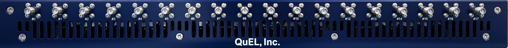
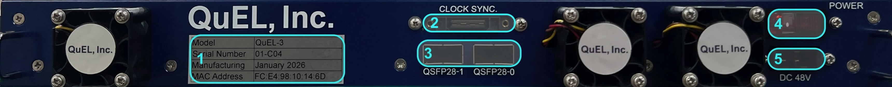

# QuEL-3 FY2025モデル 取扱説明書
版: v0.1.1 (2026/06/22)

## はじめに
キュエル社製量子コンピュータ制御装置「QuEL-3」(2025年度版)は、1台あたり8量子ビットを制御及び状態観測することを想定した装置です。
8つの制御信号ポート、2つの観測信号入出力ポートのペア、および、信号モニタリング用のSMAポートを装備しています。
複数台のQuEL-3をクラスタ化してシステムを組むことで、最大2560量子ビットを量子コンピュータとして統合して制御できます。

複数の制御装置のクラスタ化の基盤は、システム全体で共通のクロック信号とタイミング信号を分配するクロックツリーです。
クロックツリーの根本には、共通クロック信号を出力する「クロック生成器」があり、その出力を中継・分配する「クロック中継機」を経て、ツリーの葉に相当する制御装置へ至ります。
クロック生成器は最大8つのクロック中継器を束ね、各クロック中継器は最大40台の制御装置を束ねるので、最大320台の制御装置の同期動作を実現できます。
このような大規模クラスタにおいても、同期タイミングの誤差を最小化するテクノロジとして、クロックツリーの各枝の信号遅延を測定に基づいた、自動タイミング補正機能を実装しています。

### 重要な注意事項
システム立ち上げ時の各コンポーネントの電源投入は、このクロックツリーの根から葉に向かう順番で行いますが、同時に電源ツリーの根から葉に向かう順序も満たす必要があります。
[こちら](./QuEL3SystemSetup.md)に、両方を考慮したシステムの立ち上げと停止の手順の記載がありますので、システムの運用開始前にご一読ください。
特に、QuEL-3の電源遮断手順に重要な注意点があります。
**制御装置の筐体のスイッチをオフにした後、5分間は電源供給を保ち、冷却ファンを動作させておいてください。**
これは、電力消費量が大きい内部コンポーネントの永久故障を防止するために欠かせない手順となっています。
この点だけ遵守していただければ、他の失敗モードからのリカバリは可能な設計になっております。

## 外観
### 装置前面
機体前面パネルにはRF信号入出力用のSMAポートが18個並んでいます。
各ポートの機能は以下のとおりです。

|                             ポート番号                              | 名称                                                          | 方向性                                     | 機能概要                                                                                                                 |
|:--------------------------------------------------------------:|-------------------------------------------------------------|-----------------------------------------|----------------------------------------------------------------------------------------------------------------------|
| &nbsp;&nbsp;&nbsp;&nbsp;&nbsp;#0&nbsp;&nbsp;&nbsp;&nbsp;&nbsp; | Read-in #0 &nbsp;&nbsp;&nbsp;&nbsp;&nbsp;&nbsp;&nbsp;&nbsp; | 入力 &nbsp;&nbsp;&nbsp;&nbsp;&nbsp;&nbsp; | 観測信号入力用のポートです。ポート#1が出力する 0.5GHzから8.5GHzの観測信号に対する量子ビットの応答を取り込むのに用います。                                                 |
|                               #1                               | Read-out #0                                                 | 出力                                      | 観測信号出力用ポートです。0.5GHzから8.5GHzの範囲の連続する1.0GHz帯域の信号を2つ出力可能です。ただし、2つの出力帯域の中心周波数の差が3.0GHz以内でなければなりません。                      |
|                               #2                               | Ctrl #0                                                     | 出力                                      | 制御信号出力ポートです。0.5GHzから8.5GHzの範囲の連続する2.0GHz帯域の信号を出力可能です。                                                                |
|                               #3                               | Pump #0                                                     | 出力                                      | ポンプ信号出力用のポートです。0.5GHzから8.5GHzの範囲の連続する2.0GHz帯域の信号を出力可能です。                                                             |
|                               #4                               | Ctrl #1                                                     | 出力                                      | 制御信号出力ポートです。0.5GHzから8.5GHzの範囲の連続する2.0GHz帯域の信号を2つ出力可能です。 ただし、2つの出力帯域の中心周波数の差が2.0GHz以内でなければなりません。                  　   |
|                               #5                               | Mon-in #0                                               | 入力                                      | 各種信号をモニタするためのポートです。このポートに入力した信号は、もうひとつのモニタポートからの入力や内部のモニタループバック回路への入力と合波された上で、モニタ用のADCに入力します。    　                   |
|                               #6                               | Mon-out #0                                              | 出力                                      | ポート#1, #2, #3, #4 から出力するはずの信号を、選択的にこちらのポートから出力することができます。出力信号の測定用途で計測器を繋いだり、装置間の同期精度の測定用途で他の制御装置のモニタ入力に繋いだりして使用します。   |  
|                               #7                               | Read-in #1                                                  | 入力                                      | 観測信号入力用のポートです。ポート#8が出力する 0.5GHzから8.5GHzの観測信号に対する量子ビットの応答を取り込むのに用います。                                                 |
|                               #8                               | Read-out #1                                                 | 出力                                      | 観測信号出力用ポートです。0.5GHzから8.5GHzの範囲の連続する1.0GHz帯域の信号を2つ出力可能です。ただし、2つの出力帯域の中心周波数の差が3.0GHz以内でなければなりません。                      |
|                               #9                               | Ctrl #2                                                     | 出力                                      | 制御信号出力ポートです。0.5GHzから8.5GHzの範囲の連続する2.0GHz帯域の信号を出力可能です。                                                                |
|                              #10                               | Pump #1                                                     | 出力                                      | ポンプ信号出力用のポートです。0.5GHzから8.5GHzの範囲の連続する2.0GHz帯域の信号を出力可能です。                                                             |
|                              #11                               | Ctrl #3                                                     | 出力                                      | 制御信号出力ポートです。0.5GHzから8.5GHzの範囲の連続する2.0GHz帯域の信号を2つ出力可能です。ただし、2つの出力帯域の中心周波数の差が2.0GHz以内でなければなりません。                       |
|                              #12                               | Mon-in #1                                               | 入力                                      | 各種信号をモニタするためのポートです。このポートに入力した信号は、もうひとつのモニタポートからの入力や内部のモニタループバック回路への入力と合波された上で、モニタ用のADCに入力します。    　                   |
|                              #13                               | Mon-out #1                                              | 出力                                      | ポート#8, #9, #10, #11 から出力するはずの信号を、選択的にこちらのポートから出力することができます。出力信号の測定用途で計測器を繋いだり、装置間の同期精度の測定用途で他の制御装置のモニタ入力に繋いだりして使用します。 |  
|                              #14                               | Ctrl #4                                                     | 出力                                      | 制御信号出力ポートです。0.5GHzから8.5GHzの範囲の連続する2.0GHz帯域の信号を出力可能です。                                                                |
|                              #15                               | Ctrl #5                                                     | 出力                                      | 制御信号出力ポートです。0.5GHzから8.5GHzの範囲の連続する2.0GHz帯域の信号を出力可能です。                                                                |
|                              #16                               | Ctrl #6                                                     | 出力                                      | 制御信号出力ポートです。0.5GHzから8.5GHzの範囲の連続する2.0GHz帯域の信号を2つ出力可能です。ただし、2つの出力帯域の中心周波数の差が2.0GHz以内でなければなりません。                       |
|                              #17                               | Ctrl #7                                                     | 出力                                      | 制御信号出力ポートです。0.5GHzから8.5GHzの範囲の連続する2.0GHz帯域の信号を2つ出力可能です。ただし、2つの出力帯域の中心周波数の差が2.0GHz以内でなければなりません。                       |

### 装置背面
背面パネルには電源・通信・タイミング同期関連の端子を配置しています。各部の用途は以下のとおりです。

|                 図中番号                  | 名称                                                             | 用途など                                                                              |
|:-------------------------------------:|----------------------------------------------------------------|-----------------------------------------------------------------------------------|
| &nbsp;&nbsp;&nbsp;1&nbsp;&nbsp;&nbsp; | 個体情報シール &nbsp;&nbsp;&nbsp;&nbsp;&nbsp;&nbsp;&nbsp;&nbsp;&nbsp; | 各個体の識別番号や固有情報を記載したシールです。キュエル社では、全ての出荷済みの個体の来歴を記録しておりますので、弊社のサポートを受ける際には個体番号が必要です。 | 
|                   2                   | クロック入力端子  　                                                    | 制御装置用のクロック信号及びタイミング信号を入力する端子です。専用ケーブルを介して、クロック生成器あるいはクロック中継器と接続して使います。            |
|                   3                   | QSFPコネクタ                                                       | データ転送用のQSFPコネクタを2つ備えています。2026年1月のリリース時点では、1つのQSFPコネクタのうちの1チャネルを10GbEとして使用しています。   |
|                   4                   | 電源スイッチ                                                         | 電源投入用のスイッチです。電源が投入されると、オレンジ色に光ります。                                                |
|                   5                   | 電源コネクタ                                                         | 専用電源モジュールから、専用ケーブルを用いて、DC48Vを接続します。                                               |

## SMA信号ポート

### 制御信号出力・ポンプ信号出力
制御信号出力ポートおよびポンポ信号出力ポートは、0.5GHzから8.5GHzの周波数範囲のRF信号を出力できます。
制御出力ポートの半数は 連続した2.0GHz帯域の任意波形を同時に2つ、16bitの分解能で出力可能です。
ただし、2つの出力帯域の中心周波数の差は2.0GHz以下である必要があります。
制御出力ポートの残りの半数とポンプ信号出力ポートについては、連続する2.0GHz帯域の任意波形1つを、16bitの分解能で出力可能です。
2.0GHz帯域の任意波形は2.5Gサンプル/秒の複素サンプルの時系列として与えます。

QuEL-3は、デジタル的な位相・振幅調整の仕組みを内蔵しており、複素サンプル時系列をDAC部に向けて出力する直前に、任意の複素系数を乗じることができます。
この仕組みは、波形出力開始時のDAC部内にあるNCOの位相の隠蔽に用いられるので、ユーザが特に意識する必要はありません。
また、バーチャルZゲートの実現などにも用いられます。

DAC部は、この時系列を20Gサンプル/秒にアップコンバートし、NCOを用いたデジタル周波数変換を経て、0.5GHz〜8.5GHzの範囲のアナログ信号として出力します。
DAC部が出力したアナログ信号は、RFスイッチ網によって、所定のポートからの出力をオン・オフするだけでなく、モニタポートへ出力を変更したり、あるいは、内部のモニタ用ADCへループバック接続したりできます。
これらの詳細については、後日公開のAPIのドキュメントをご覧くださいませ。

### 観測信号出力
観測信号出力ポートは、0.5GHzから8.5GHzの周波数範囲がRF信号を出力できます。
この周波数範囲に含まれる連続した1.0GHz帯域の任意波形2つを、16bitの分解能で出力可能です。
ただし、2つの出力帯域の中心周波数の差は3.0GHz以下である必要があります。
出力帯域の分割は、TWPAの両サイドバンドに渡る出力のデジタイズをひとつのポートでカバーするケースでの利便性確保が理由です。

### 観測信号入力
観測信号入力ポートは、観測信号出力ポートの出力信号の反射波を受信に特化したポートです。
-25dBmの入力パワーでフルスイングとなる増幅率のLNAを搭載しており、0.5GHzから8.5GHzの周波数範囲内の連続した1.0GHz帯域のアナログ信号を2つ同時にデジタイズできます。
デジタイズ後のデータの形式は、1.25Gサンプル/秒の複素サンプルの時系列になります。

各ポートあたり8つのデジタル演算処理モジュールを持っており、観測出力信号との相対位相の計算をサポートします。
キャリブレーションパラメタとして、量子ビットの状態ごとのIQ平面上での相対位相の平均値と分散を与えることで、量子ビットの状態の混合ガウスモデルに基づいた最尤推定もサポートします。
次バージョンのファームウェアでは、この結果に基づいた出力波形のフィードバック制御が可能になる予定です。

なお、観測信号入力ポートは、ペアとなる観測信号出力ポートが決まっています。

- SMAポート#1が出力する観測信号に対する量子ビットの読出し共振器の応答をSMAポート#0で取り込みます。
- SMAポート#8が出力する観測信号に対する量子ビットの読出し共振器の応答をSMAポート#7で取り込みます。

### モニタ用ポート
モニタ用ポートは、キュエル社のシステムソフトウェアが装置状態のキャリブレーション・監視・メンテナンスなどに使用します。
お客様側での動作確認などのご要望が発生した場合に、ご使用方法をお伝えできますが、基本的には非公開の機能となっております。
装置の設置時に、キュエル社がモニタ系を介して装置間の接続をいたします。
この接続はお客様側で変更なさらないようお願い致します。

## クロック信号の無供給時の制御装置の挙動
共通クロック信号の供給が無い場合、QuEL-3は自動的にリカバリモードで再起動します。
たとえば、以下のような操作をすると、QuEL-3はOSレベルでフリーズしますが、30秒後に自動的にリカバリモードで再起動します。

- クロック生成器および中継器の電源投入前にQuEL-3を起動する。
- QuEL-3の動作中にクロックケーブルの挿抜をする。
- QuEL-3の動作中にクロック生成器ないし中継器の電源を落としたり、投入したりする。

リカバリモードでは、制御装置としての機能提供がありません。
このモードでは、障害の原因を明らかにしたり、また、必要があれば通常モードのOSイメージの復旧やアップデートを行います。
なお、通常モードへの復帰には再起動が必要になります。

制御装置のブートモードを含む状態や各種テレメトリ情報はダッシュボードから確認いただけるようにします。
通常モードへの復帰についても、管理ツールから実施できるように致します。
なお、制御装置の電源スイッチの再投入時には、必ず、通常モードでの起動を試みるようになっておりますので、
オペレーションミス起因でのリカバリモードへの落ち込みが明らかな場合には、一度だけ、QuEL-3の背面スイッチをつかったパワーサイクルを実施してみるのも良いかもしれません。
それでも復帰しない場合には、ダッシュボードなどで情報取得して原因究明を行うべきです。
