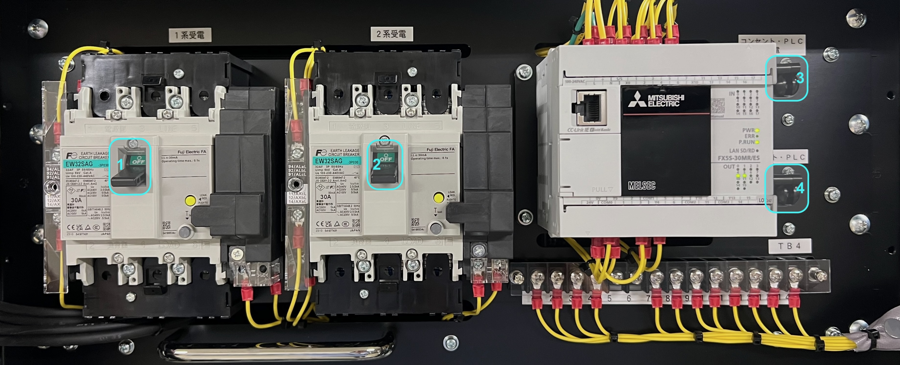
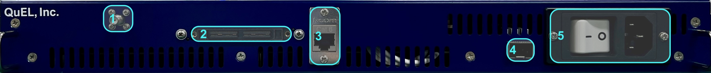
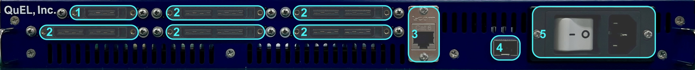

# QuEL-3 量子コンピュータ制御システムの起動から停止まで
版: v0.1.0 (2026/01/27)

## 概要
QuEL-3 量子コンピュータ制御システムの運用についての重要な手順上の注意点を説明する。
システムの起動時および停止時の操作手順における、操作手順の制約を規定する。
給電停止の手順において**制御装置の永久故障**防止に必須の手順があるので、この点だけは特に注意が必要である。

## 制御システムのハードウェア構成
QuEL-3 制御システムにおける主役は制御装置 QuEL-3だが、以下に列挙する装置群によって支えらることで、ひとつのシステムたり得ている。

- **システム管理PC (System Manager)**: システム全体を管理するPC。システム内の各装置のログ収集及び監視や、量子ビット制御信号の装置間のタイミング同期の維持など、システムのハウスキーピングを行う。また、ユーザの実験コードは、このPCのポートに対してリクエストを行うことになる。
- **ラック電源部 (lack power module)**: ラック単位に設置し、ラック内の全ての装置に電源を供給する。PLC ユニットと直流電源ユニットから構成される。
- **ネットワークスイッチ (Network switch)**: ラック単位に設置し、ラック内の全ての制御装置にネットワーク接続を中継する。
- **クロック生成器（QuEL-3 Clock master）**： システムにひとつだけ設置し、システム中の全ての制御装置を駆動するクロック信号およびタイミング信号を生成する装置である。8台までの制御装置またはクロック中継器へクロック信号などを分配できる。
- **クロック中継器（QuEL-3 Clock relay）**： ラック単位に設置し、クロック生成器から受け取ったクロックなどの信号を、最大40台の制御装置に分配する装置である。クロック中継器の複数段カスケードには対応していない。
- **ルビジウムクロック (Rubidium reference clock)**: クロック生成器のOCXOのオーブン制御を介した周波数補正に使用するクロック源。量子コンピュータの制御には必須ではないが、計測器との連携には一定の有用性がある。

## 電源投入・遮断の手順
最初に全体の電源投入・遮断の手順を示す。
手順の理由づけについては、各コンポーネントの説明を交えつつ順次行っていく。

### 電源投入手順
1. 管理PCが動作していることを確認する。動作していなければ起動する。 
1. 各ラックの電源部の各スイッチを[所定の順序](#ラック電源部の電源投入の手順詳細)で投入する。
    - ネットワークスイッチ・ルビジウムクロックの電源が投入されていることを確認する。これらの装置は、スイッチを入れっぱなしにしておくのがよいだろう。
    - そのほかの装置は、この時点でスイッチがオフになっているはずである。
    - なお、48V電源がオンになった時点で、QuEL-3の冷却ファンが回りだす。
1. [クロック生成器](#クロック生成器)の電源を投入し、クロック信号の出力開始を待つ。
    - 1分ほどでクロック信号の出力が始まる。
1. 各ラックの[クロック中継器](#クロック中継器)の電源を投入する。
1. 各ラックの全ての[制御装置](./QuEL3ReferenceManual.md)の電源スイッチを投入する。

### 電源遮断手順
- 全ての制御装置の電源スイッチを切断する。
- ラック内の全ての制御装置がオフになったことを確認してから、クロック中継器の電源スイッチを切断する。
- 全てのクロック中継器の電源スイッチを切断してから、クロック生成器の電源スイッチを切断する。
- **5分以上待つ。**
    - 内部が十分に冷める前にファンが停止すると重要なコンポーネントが破損する恐れがあるので注意。詳しくは[こちら](#排熱に関する注意)。
- 各ラックの電源部のスイッチを[所定の順序](#ラック電源部の電源遮断の手順詳細)で遮断する。
- 必要なら管理PCシャットダウンする。

## システム管理PC
システム管理PCはネットワークインターフェースを2系統持ち、ユーザ環境ネットワークと装置ネットワークとのゲートウェイとして動作する。
初期状態では、ユーザ環境側がGbE、装置側が4つの10GbEを使用している。

現時点でPCが提供する機能、および、提供予定のある機能は以下のとおりである。

- **装置APIのプロキシサーバ：** ユーザ環境のネットワークからシステムにアクセスするポートを提供する。キュエル社が提供するQuEL-3システムのクライアントライブラリは、このポートを介して装置にリクエストを行う。
- **システムのハウスキーピング：** システム中の各制御装置の同期状態の維持などを含む、各種ハウスキーピングを担当するデーモンが動作する。ユーザプログラムとの相互作用はクライアントライブラリを介して行う。
- **システム監視ダッシュボード（予定）：** システムの各種状態を可視化するダッシュボードをWebブラウザで見ることができる。 
- **ファームウェアアップデータ（予定）：** ファームウェアのバージョン状況の確認やアップデートを行うためのGUI画面をWebブラウザで見ることができる。 

## ラック電源部
各ラックには専用の電源部があり、ラックの大元の電源スイッチ群が設置されている。
これらのスイッチの投入順序を説明する。
スイッチの遮断は、これとは逆の順序で行うことになる。
上述したとおり、システム管理PCを除くと、ラック電源部のスイッチ投入がラック内の他のコンポーネントのスイッチ投入に先立つ。
逆に、スイッチ遮断する場合には、ラック電源部のスイッチ遮断が最後になるべきである。

### ラック電源部の電源投入の手順詳細
PLCユニットには三相200V電源のブレーカーが2系統搭載しており、それぞれ「1系受電」(下図左側）及び「2系受電」（下図中央）と呼ぶ。
PLCの電源（下図右側）が投入されていない状態では、「1系受電」「2系受電」の200Vブレーカーはトリップ状態になっており投入できない。
また、100Vタップへの電源供給も、PLCの電源と連動している。

したがって、ラックに給電している上流のブレーカーを投入後、以下の手順を必ず順番通りに実施する必要がある。

1. 「コンセント・PLC受電（上図3）」をON（レバー上）にする。
1. 「コンセント・PLC（上図4）」をON（レバー上）にすると、PLCおよび100Vコンセントに電源が供給される。
1. 「1系受電（上図1）」「2系受電（上図2）」の順にOFF状態（レバー下）して、トリップを解除する。
1. 「1系受電」「2系受電」の順にON（レバー上）にする。これにより全てのQuEL-3へ電源（48V）が供給され、QuEL-3のファンが動作する。

### ラック電源部の電源遮断の手順詳細
電源を遮断する場合は、投入時と逆の順番で操作すること。
**ラック内の全てのQuEL-3の筐体側スイッチの遮断後、5分間の冷却時間が経過してから行うこと**。

1. 「2系受電」「1系受電」の順にOFF（レバー下）にして、48V電源を遮断する。
    - 48V電源を遮断するとQuEL-3のファンが停止する。このときまでに装置内部が十分に冷却できていないと、永久故障の原因となる。
1. 「コンセント・PLC」をOFF（レバー下）にして、コンセント電源およびPLCの電源を遮断する。この操作に伴いブレーカーがトリップ状態になる。音がするが異常ではない。
1. 「コンセント・PLC受電」をOFF（レバー下）にする。

## クロック系統
クロックの分配トポロジは、クロック生成器を根としクロック中継器を介して各制御装置へと至る最大深さ2以下の木構造である。
クロック中継器および制御装置は、クロック信号無しには正常な初期化ができない。
したがって、**クロック生成器、クロック中継器、制御装置の順に電源投入**する必要がある。

クロック生成器は電源投入後、装置内のシステムソフトウェアによる初期化を経て、クロック信号の供給を開始する。
クロック信号の出力開始は自動的に開始されるが、電源投入後1分後程度の待ち時間が必要である。
クロック信号供給の状態については、システム管理PCが提供するダッシュボード上で確認できるようにする予定である。
その後、ラックごとにクロック中継器の電源を投入してから、そのラック内の制御装置の電源を投入する手順となる。
クロック中継器は、クロック信号の分配を内部のソフトウェアに依存せずに開始するので、電源投入後数秒間待ってから各制御装置の電源を投入すればよい。

### クロック生成器
クロック生成器は、システム内の全ての制御装置の同期動作実現に必要な共通クロック信号及びタイミング信号を生成・分配する。
フロントパネルにあるクロック出力端子（下図2）から、8分岐の専用ケーブルを介して、クロック中継器あるいは制御装置を接続して使用する。
内蔵のOCXOは経年変化を考慮しても 1ppm以下の周波数精度を維持するが、参照信号入力コネクタ（下図1）に10MHzのルビジウムクロックを接続することで、さらなる精度で出力クロック周波数を補償することもできる。

RJ45（下図3）とSFP（下図4）の2系統のネットワークポートを持つが、通常はSFPポートだけを用いる想定である。
メンテナンスなど特別な状況以外では、RJ45ポートには何も接続せずにご使用頂きたい。
ラックの100Vタップからスイッチ付き3Pインレット（下図5）へ給電する。

### クロック中継器
クロック中継器は8台以上の制御装置で量子コンピュータ制御システムを組む場合に、クロック生成器の出力を分配するのに使用する。
フロントパネル左上のコネクタ（下図1）でクロック生成器の出力を受け、5つの出力コネクタ（下図2）に分配する。
各出力コネクタには、8分岐の専用ケーブルを介して、最大8台の制御装置を接続できる。
したがって、最大構成ではクロック生成器に8台の中継器を接続し、各中継器に40台の制御装置を接続した計320台の制御装置から成るシステムを構成できる。

中継器も生成器と同様にRJ45ポート（下図3）とSFPポート（下図4）を持っているが、通常はSFPポートだけを使用する。
ラックの100Vタップからスイッチ付き3Pインレット（下図5）へ給電する。

## 注意： QuEL-3の排熱に関して
制御装置 QuEL-3 の冷却ファンは、各装置のスイッチを投入せずとも、「一次受電」と「二次受電」のスイッチをONにした状態で動作する。
冷却ファンはそれなりの騒音を発生するので、すぐに止めたいと感じるかもしれないが、**制御装置のスイッチ切断後5分間はファンを動作させる必要**がある。
さもないと、**制御装置の重要コンポーネントが永久故障する**恐れがある。

したがって、各制御装置の電源スイッチの切断後5分間経つまでは、以下の操作を含む制御装置への給電停止を禁止とする。

- 制御装置の電源コネクタの引き抜き
- ラック電源部の電源スイッチの操作
- 上位のブレーカの操作や電源プラグの引き抜きなどによる、ラック電源ユニットへの給電の停止
