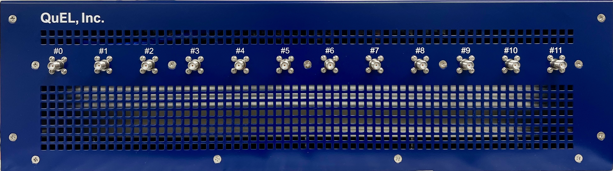
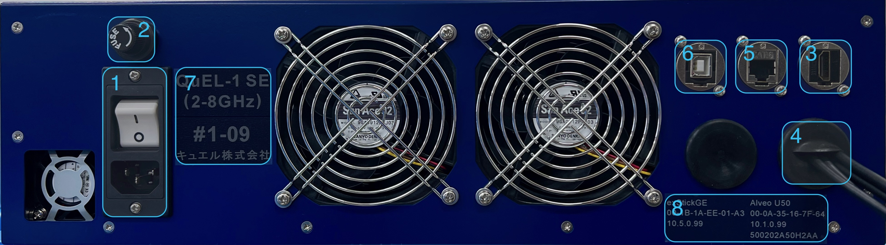

# QuEL-1 SE 2-8GHz対応 FY2023モデル 取扱説明書
キュエル社製量子コンピュータ制御装置「QuEL-1 SE」の2-8GHz対応モデル (2023年度版) の基本的な機能と使い方を説明します。
[ソフトウェアAPI](https://github.com/quel-inc/quelware/tree/main) のご使用の前提知識を多く含みます。

## 外観
### 装置前面
機体前面パネルにはRF信号入出力用のSMAポートが並んでいます。各ポートの機能は以下のとおりです。



|                             ポート番号                              | 名称                                                       | 方向性                                     | 機能概要                                                                                                                                             |
|:--------------------------------------------------------------:|----------------------------------------------------------|-----------------------------------------|--------------------------------------------------------------------------------------------------------------------------------------------------|
| &nbsp;&nbsp;&nbsp;&nbsp;&nbsp;#0&nbsp;&nbsp;&nbsp;&nbsp;&nbsp; | Read-in &nbsp;&nbsp;&nbsp;&nbsp;&nbsp;&nbsp;&nbsp;&nbsp; | 入力 &nbsp;&nbsp;&nbsp;&nbsp;&nbsp;&nbsp; | 観測信号入力用のポートです。ポート#1が出力する 5.8GHzから8.0GHzの観測信号に対する量子ビットの応答を取り込むのに用います。                                                                             |
|                               #1                               | Read-out / Fogi                                          | 出力                                      | 観測信号出力及びFOGI信号出力用のポートです。前者は5.8GHzから8.0GHzの周波数範囲、後者は2.0GHzから5.8GHzの周波数範囲の信号を出力できます。両方の信号を同時に出力可能です。                                               |
|                               #2                               | Pump                                                     | 出力                                      | ポンプ信号出力用のポートです。5.8GHzから8.0GHzの範囲の信号を出力可能です。                                                                                                      |
|                               #3                               | Ctrl (extra)                                             | 出力                                      | 予備の制御信号出力ポートです。2.0GHzから5.8GHzの範囲の信号を出力可能です。                                                                                                      |
|                               #4                               | Monitor-in-#0                                            | 入力                                      | 信号のモニタリング用のポートです。各装置に2つあるモニタリング系のひとつ(#0)に外部から信号を入力するのに用います。ポート#1, #2, #3の信号モニタ出力をの装置内ループバック監視用のADCへ接続しているので、装置内ループバック使用時には外部から信号を受け付けられません。      |
|                               #5                               | Monitor-out-#0                                           | 出力                                      | ポート#1, #2, #3の信号モニタ出力を外部に取り出すのに使用します。モニタ出力を装置内ループバック監視する場合には、ポートへの出力はできません。                                                                      |
|                               #6                               | Ctrl-#0                                                  | 出力                                      | 制御信号出力ポートです。2.0GHzから5.8GHzの範囲の信号を出力可能です。                                                                                                         |
|                               #7                               | Ctrl-#1                                                  | 出力                                      | 制御信号出力ポートです。2.0GHzから5.8GHzの範囲の信号を出力可能です。                                                                                                         |
|                               #8                               | Ctrl-#2                                                  | 出力                                      | 制御信号出力ポートです。2.0GHzから5.8GHzの範囲の信号を出力可能です。                                                                                                         |
|                               #9                               | Ctrl-#3                                                  | 出力                                      | 制御信号出力ポートです。2.0GHzから5.8GHzの範囲の信号を出力可能です。                                                                                                         |
|                              #10                               | Monitor-in-#1                                            | 入力                                      | 信号のモニタリング用のポートです。各装置に2つあるモニタリング系のひとつ(#1)に外部から信号を入力するのに用います。ポート#6, #7, #8, #9の出力信号のモニタ出力の装置内ループバック監視用ADCへ接続しているので、装置内ループバック使用時には外部から信号を受け付けられません。 |
|                              #11                               | Monitor-out-#1                                           | 出力                                      | ポート#6, #7, #8, #9の信号モニタ出力を外部に取り出すのに使用します。モニタ出力を装置内ループバック監視する場合には、ポートへの出力はできません。                                                                  |

### 装置背面
背面パネルには電源・通信・メンテナンス関連の端子を配置しています。各部の用途は以下のとおりです。



|     図中番号      | 名称                                                                | 用途など                                                                                                                                                         |
|:-------------:|-------------------------------------------------------------------|--------------------------------------------------------------------------------------------------------------------------------------------------------------|
| &nbsp;&nbsp;&nbsp;1&nbsp;&nbsp;&nbsp; | AC電源インレット &nbsp;&nbsp;&nbsp;&nbsp;&nbsp;&nbsp;&nbsp;&nbsp;&nbsp;  | 100VACの商用電源に接続します。電源投入用のスイッチとヒューズボックスが付いています。                                                                                                                | 
|       2       | サーキットブレーカ                                                         | 過電流検出時に電源を遮断します。作動した場合には故障が疑われますのでサポートまでお問い合わせください。                                                                                                          |
|       3       | クロック入力端子  　                                                       | 制御装置用の3系統クロック (250MHz, 100MHz, 62.5kHz) を入力する端子です。クロック分配器と接続して使います。HDMI端子を流用しています。                                                                           |
|       4       | 10GbE DACケーブル                                                     | 4系統 (A,B,C,D) のケーブルが出ています。それらのうち、現在はAとBの2系統を使用しており、残りは将来の拡張用です。A系統はコマンド及びデータ転送、B系統は時刻同期に用いています。複数台の制御装置でシステムを構成するときは、A系統とB系統とのそれぞれに専用のスイッチングハブを用いることをお勧めします。 |
|       5       | 設定系RJ45端子                                                         | 装置内部の各種コンポーネントの設定用のGbE端子です。この系統にも、10GbEのハブとは別個に、専用のハブを用意することをお勧めします。                                                                                         |
|       6       | FPGAファームウェア<br>プログラミング端子                                          | 波形生成・キャプチャ機能を実装するFPGAのファームウェア更新・FPGAの外部リセットに用いるUSB-TypeA端子です。PCとの接続状態では、FPGAは電源投入直後にリセット状態で留め置かれ、起動にPCからのコマンド操作が必要になりますのでご注意ください。                            |
|       7       | 個体番号シール                                                           | 個体番号識別用のシールです。キュエル社では、全ての出荷済みの個体の来歴を記録しておりますので、弊社のサポートを受ける際には個体番号が必要です。                                                                                      |
|       8       | 個体情報シール                                                           | 各個体に固有の情報を記載したシールです。PCからの操作時に使用する個体情報が書いてあります。                                                                                                               |  

## 信号出力ポート

### 観測出力信号・ポンプ信号
5.8GHzから8.0GHzの範囲の信号生成の経路には次のコンポーネントが関わっています。
- 制御用PC
- AWGユニット (FPGA)
- デジタルアップコンバータ + DAC (AD9082)
- アナログアップコンバータ (LMX2594 + ADRF6780)
- その他アナログコンポーネント (フィルタ・RFスイッチ・LNAなど)

まず、制御用PCから制御装置内のメモリへ波形データを転送します。
波形データは500MSpsのベースバンドIQ信号で、I/Q各成分とも16bitの符号付き整数です。
AWGユニットはIQ信号を装置内部メモリから取り出し、AD9082へ供給します。
単純な転送機能に加えて、無信号区間の挿入機能と自動繰り返し機能とを備えているので、PCからのデータ転送量および装置内のメモリ容量の大幅な削減を実現します。
AD9082内の経路には2つのデジタルアップコンバータ (FDUC, CDUC) があり、500MHz帯域のベースバンド信号を2段階でデジタルアップコンバートして、最終的に6GHz帯域のアナログ信号として出力します。
その後段のアナログアップコンバータを用いて最終的に6GHzから8GHzの範囲に周波数変換を行い、フィルタ・アナログスイッチ・LNAなどのアナログコンポーネントを介してSMAポートから出力します。

#### 設定可能パラメタ
QuEL-1 SEでサポートしているIQ信号以外の可変パラメタは以下のとおりです。

| 名称                                                                           | 対象                                                          | 　説明                                                                                                                                                                                                                                                                                                                   |
|------------------------------------------------------------------------------|-------------------------------------------------------------|-----------------------------------------------------------------------------------------------------------------------------------------------------------------------------------------------------------------------------------------------------------------------------------------------------------------------|
| FNCO周波数 (FNCO) &nbsp;&nbsp;&nbsp;&nbsp;&nbsp;&nbsp;&nbsp;&nbsp;&nbsp;&nbsp;  | 周波数 &nbsp;&nbsp;&nbsp;&nbsp;&nbsp;&nbsp;&nbsp;&nbsp;&nbsp;  | AD9082の細デジタルアップコンバータへ入力する数値制御局所発振器の出力周波数です。-1000MHz から 1000MHz の範囲で指定できますが、-850MHz以下、あるいは、850MHz以上の出力信号成分に対して折り返しが発生するので注意が必要です。                                                                                                                                                                                      |
| CNCO周波数 (CNCO)                                                               | 周波数                                                         | AD9082の粗デジタルアップコンバータへ入力する数値制御局所発振器の出力周波数です。理論的には0MHzから6000MHzの範囲で指定可能ですが、AD9082のDAC出力がアナログカップリングされていることや、後段のアナログミキサの入力範囲が700MHzから3.5GHzの範囲であることなどから、実用的な設定可能範囲は制約されます。                                                                                                                                                |
| Full Scale Current (FSC)                                                     | 強度                                                          | AD9082のDAC出力のフルスケール電流をuA単位で与えます。範囲は7000uAから40000uAです。特例として従来モデル(QuEL-1)で使用していた40527uAも指定可能です。詳しくは[AD9082のユーザガイド](https://www.analog.com/media/en/technical-documentation/user-guides/ad9081-ad9082-ug-1578.pdf)のp.188を参照してください。                                                                                       |
| LO周波数 (LO)                                                                   | 周波数                                                         | アナログミキサへ入力する局所発振器の出力周波数です。この局所発振器への入力周波数は100MHzで、内蔵のPLLで周波数を75倍から150倍の範囲で整数倍した後に、ディバイダで1倍・1/2倍あるいは1/4倍して出力します。                                                                                                                                                                                                        |
| Variable Attenuator 設定値 (VATT)                                               | 強度                                                          | アナログミキサが内蔵する可変アッテネータへの設定値です。歴史的理由でミキサIC(ADRF6780)のVATT端子へ電圧供給している12bit 低速DACの出力設定値を与えます。低速DACはフルスケールで3.3Vを出力しますが、VATT端子の入力範囲は0Vから2.6Vなので、0から3226(=0xC9A)の範囲で指定します。設定値範囲の下限付近と上限付近ではゲインが非線形になります。詳しくは[ADRF6780のデータシート](https://www.analog.com/media/en/technical-documentation/data-sheets/ADRF6780.pdf)のp.9を参照してください。 |
| ミキサ出力サイドバンド指定 (SB)                                                           | 周波数                                                         | QuEL-1 SEではミキサIC(ADRF6780)をIFモードで用いているので、サイドバンドを選択する必要があります。下側(L)あるいは上側(U)を指定します。それぞれの場合で、出力周波数は (LO-(FNCO+CNCO)) あるいは、(LO+FNCO+CNCO) となります。                                                                                                                                                                          |
| RFスイッチ                                                                       | オン・オフ                                                       | 信号の出力をオン・オフします。オフ時には60dB以上の阻止能力があります。パラメタ変更時に意図しない信号が外部に漏れださないようにオフにしてください。なお、観測出力については、信号オフ時に観測信号の内部ループバック経路が有効になります。これについては後述します。                                                                                                                                                                                   |

### 制御信号・FOGI信号
2.0GHzから5.8GHzの範囲の信号生成経路には、5.8GHzから8.0GHzの経路に含まれていたアナログアップコンバータ以外のコンポーネントが含まれています。
- 制御用PC
- AWGユニット (FPGA)
- デジタルアップコンバータ + DAC (AD9082)
- その他アナログコンポーネント (フィルタ・RFスイッチ・LNAなど)

#### 設定可能パラメタ
QuEL-1 SEでサポートしているIQ信号以外の可変パラメタは以下のとおりです。
アナログアップコンバータが無い都合で、CNCOの周波数の制約が緩和します。

| 名称                                                                           | 対象                                                   | 　説明                                                                                                                                                                                                                             |
|------------------------------------------------------------------------------|------------------------------------------------------|---------------------------------------------------------------------------------------------------------------------------------------------------------------------------------------------------------------------------------|
| FNCO周波数 (FNCO) &nbsp;&nbsp;&nbsp;&nbsp;&nbsp;&nbsp;&nbsp;&nbsp;&nbsp;&nbsp;  | 周波数 &nbsp;&nbsp;&nbsp;&nbsp;&nbsp;&nbsp;&nbsp;&nbsp; | AD9082の細デジタルアップコンバータへ入力する数値制御局所発振器の出力周波数です。-1000MHz から 1000MHz の範囲で指定できますが、-850MHz以下、あるいは、850MHz以上の出力信号成分に対して折り返しが発生するので注意が必要です。                                                                                                |
| CNCO周波数 (CNCO)                                                               | 周波数                                                  | AD9082の粗デジタルアップコンバータへ入力する数値制御局所発振器の出力周波数です。理論的には0MHzから6000MHzの範囲で指定可能ですが、AD9082のDAC出力がアナログカップリングなのでDAC出力の下限が500MHz以上になる範囲での使用をお勧めします。                                                                                           |
| Full Scale Current (FSC)                                                     | 強度                                                   | AD9082のDAC出力のフルスケール電流をuA単位で与えます。範囲は7000uAから40000uAです。特例として従来モデル(QuEL-1)で使用していた40527uAも指定可能です。詳しくは[AD9082のユーザガイド](https://www.analog.com/media/en/technical-documentation/user-guides/ad9081-ad9082-ug-1578.pdf)のp.188を参照してください。 |
| RFスイッチ                                                                       | オン・オフ                                                | 信号の出力をオン・オフします。オフ時には60dB以上の阻止能力があります。パラメタ設定中に意図しない信号が外部に漏れださないようにオフにしてください。                                                                                                                                                     | 

#### チャネル割り当て
独立した500MSpsのベースバンド信号発生の単位をチャネルと呼びます。
以下の表のとおり、制御信号用のポートの一部は、複数のチャネルを割り当ててあります。

|     SMAポート     |     割り当てチャネル数      |
|:--------------:|:------------------:|
| &nbsp;#1&nbsp; | (観測信号用のチャネルとは別に) 1 |
|       #3       |         3          |
|       #6       |         3          |
|       #7       |         1          |
|       #8       |         1          |
|       #9       |         3          |

各チャネルは一組のAWGとFNCOを持っており、CNCOがカバーする2GHz(実効1.6GHz)の範囲内であれば、各チャネル独立に500MHz帯域(実効400MHz帯域)を異なった中心周波数で生成可能です。
この割り当ては、ポート#6からポート#9までの4つのポートの間で融通可能なので、今後、ユーザ様のご要望に応じて調整したいと考えています。
その際には、後述するデジタルコンバインの実ユースケースと考え合わせることになります。
ポート#3 についても同様の調整が可能ですが説明を省きます。
必要に応じて、お問い合わせください。

#### ポートのデジタルコンバイン
さらに、SMAポート#6 あるいは、#8 はデジタルコンバイン機能を用いることで、それぞれ #7 あるいは #9 の出力を合波して出力できます。
その場合には、ひとつのSMAポートに、2つのCNCOが独立して存在する状況になります。
つまり、2.0GHzから5.8GHz の範囲で、2つの2GHz帯域(実効1.6GHz)帯域を独立に指定できます。
ただし、取り込まれた #7 あるいは #9 は出力できなくなります。

## 信号入力ポート
各入力SMAポートには、対になる出力SMAポートが存在するので、合わせて説明します。

### 観測ポートペア (#0, #1)
SMAポート#1が出力する観測信号に対する量子ビットの読出し共振器の応答をSMAポート#0で取り込みます。
観測入力経路は以下のコンポーネントを含みます。

- アナログコンポーネント (LNA・RFスイッチ・フィルタなど)
- アナログダウンコンバータ (LMX2594 + ミキサ)
- ADC + デジタルダウンコンバータ (AD9082)
- 4つのキャプチャユニット (FPGA)

アナログダウンコンバータの局所発振器は SMAポート#0のアナログアップコンバータの局所発振器と共通です。
この設計によって、局所発振器に位相揺らぎが発生したとしても、入力信号のベースバンド信号処理には影響が及びません。
入力RF信号をベースバンドに変換するパイプラインは、観測信号出力のアップコンバートの裏返しになっています。
アナログダウンコンバータによって、観測信号のDACの出力周波数と同じ周波数にダウンコンバートした信号は、AD9082のADCでデジタル信号に変換した後で、同ICのデジタルダウンコンバータで-250MHzから250MHzの範囲のベースバンド信号にさらにダウンコンバートします。
AD9082の各ADC経路にはCDDCとFDDCの2段階のデジタルダウンコンバータがありますが、現状のファームウェアの下ではFDDCを使う必要性はありません。
したがって、FDDCへ入力する数値制御発振器はデフォルト設定の0Hzから変更しないことをお勧めします。
ひとつのFDDCの500MHz帯域 (実効400MHz帯域) の出力が 4つのキャプチャユニットへ入力します。
各キャプチャユニットには積算・総和・フィルタ・位相判定などのDSP機能が内蔵されており、4つまでの量子ビットの多重化観測に対応しています。

#### 可変パラメタ

| 名称                                                                   | 対象                                                      | 　説明                                                                                                                                                                                                                                                                                                                           |
|----------------------------------------------------------------------|---------------------------------------------------------|-------------------------------------------------------------------------------------------------------------------------------------------------------------------------------------------------------------------------------------------------------------------------------------------------------------------------------|
| RFスイッチ&nbsp;&nbsp;&nbsp;&nbsp;&nbsp;&nbsp;&nbsp;&nbsp;&nbsp;&nbsp;   |  オン・オフ &nbsp;&nbsp;&nbsp;&nbsp;&nbsp;&nbsp;&nbsp;&nbsp; | 信号入力の通過・遮断を制御します。外部入力を遮断すると観測出力信号の内部ループバック経路が有効になり、観測出力信号が外部に出力されなくなります。                                                                                                                                                                                                                                                      |
| LO周波数 (LO)                                                           | 周波数                                                     | アナログダウンコンバータへ入力する局所発振器の出力周波数です。観測信号出力と共通です。この局所発振器への入力周波数は100MHzで、内蔵のPLLで周波数を75倍から150倍の範囲で整数倍した後に、ディバイダで1倍・1/2倍あるいは1/4倍して出力します。                                                                                                                                                                                               |
| CNCO周波数 (CNCO)                                                       | 周波数                                                     | AD9082の粗デジタルダウンコンバータへ入力する数値制御局所発振器の出力周波数です。理論的には0MHzから3000MHzの範囲で指定可能ですが、AD9082のADC入力がアナログカップリングされていることで制約が発生します。通常は観測出力信号のCNCO周波数と同じ値に設定します。「同じ値」に関して注意点があるので後述します。                                                                                                                                                          |
| FNCO周波数 (FNCO)                                                       | 周波数                                                     | AD9082の細デジタルダウンコンバータへ入力する数値制御局所発振器の出力周波数です。通常は0Hzで使います。                                                                                                                                                                                                                                                                       |
| DSP機能の各種設定値                                                          | 信号処理                                                    | 詳細は[e7awgswライブラリのドキュメント](https://github.com/e-trees/e7awg_sw/tree/main/manuals#4-%E3%82%AD%E3%83%A3%E3%83%97%E3%83%81%E3%83%A3%E3%83%A2%E3%82%B8%E3%83%A5%E3%83%BC%E3%83%AB%E3%82%BD%E3%83%95%E3%83%88%E3%82%A6%E3%82%A7%E3%82%A2%E3%82%A4%E3%83%B3%E3%82%BF%E3%83%95%E3%82%A7%E3%83%BC%E3%82%B9%E4%BB%95%E6%A7%98)を参照してください。 |

### モニタポートペア (#4, #5 及び #10, #11)
出力信号のモニタ系が各制御装置に2系統あり、モニタ#0系統がSMAポート#1, #2, #3の出力を、モニタ#1系統がSMAポート#6, #7, #8, #9の出力を合波のうえ方向性結合器(-20dB)を介してモニタ出力として提供します。
各系統のモニタ出力は、#0系統がSMAポート#5, #1系統がSMAポート#11から外部に取り出せます。
単純なモニタリングでは、モニタ出力を外部に取り出さずとも、対応するモニタ入力ポートへ装置内ループバック経路を介してキャプチャできます。

モニタ出力とモニタ入力とのRFスイッチは連動しており、装置内ループバック経路を有効化するか否かの設定ができます。
装置内ループバック経路が無効な場合には、モニタ出力SMAポートからはモニタ信号が出力され、また、モニタ入力SMAポートは外部から入力信号を取れるようになります。
有効な場合には、外部への出力と外部からの入力の両方が遮断されます。

モニタ入力経路は以下のコンポーネントを含みます。

- アナログコンポーネント (LNA・RFスイッチなど) 
- アナログダウンコンバータ (LMX2594 + ミキサ)
- ADC + デジタルダウンコンバータ (AD9082)
- 1つの簡易版キャプチャモジュール (FPGA)

モニタ入力も観測入力と同様に、アナログダウンコンバータとデジタルダウンコンバータを持ちますが、両系統のモニタ入力がアナログ局所発振器を共有しているので注意が必要です。
個別の周波数設定はできません。
一方で、デジタルダウンコンバータは系統ごとに独立しています。
FDDCでベースバンド信号に変換された後、キャプチャユニットに渡りますが、現状のファームウェアではモニタ用のキャプチャユニットにはDSP機能が内蔵されていません。
制御信号ポートから出力した信号の生波形をモニタリングすることに特化しているとお考えください。

#### 可変パラメタ

| 名称                                                                    | 対象                                                    | 　説明                                                                                                                                                                  |
|-----------------------------------------------------------------------|-------------------------------------------------------|----------------------------------------------------------------------------------------------------------------------------------------------------------------------|
| RFスイッチ  &nbsp;&nbsp;&nbsp;&nbsp;&nbsp;&nbsp;&nbsp;&nbsp;&nbsp;&nbsp;  | オン・オフ&nbsp;&nbsp;&nbsp;&nbsp;&nbsp;&nbsp;&nbsp;&nbsp; | 信号入力の通過・遮断を制御します。外部入力を遮断すると観測出力信号の内部ループバック経路が有効になり、観測出力信号が外部に出力されなくなります。                                                                                             |
| LO周波数 (LO)                                                            | 周波数                                                   | アナログダウンコンバータへ入力する局所発振器の出力周波数です。観測信号出力と共通です。この局所発振器への入力周波数は100MHzで、内蔵のPLLで周波数を75倍から150倍の範囲で整数倍した後に、ディバイダで1倍・1/2倍あるいは1/4倍して出力します。                                      |
| CNCO周波数 (CNCO)                                                        | 周波数                                                   | AD9082の粗デジタルダウンコンバータへ入力する数値制御局所発振器の出力周波数です。理論的には0MHzから3000MHzの範囲で指定可能ですが、AD9082のADC入力がアナログカップリングされていることで制約が発生します。通常は観測出力信号のCNCO周波数と同じ値に設定します。「同じ値」に関して注意点があるので後述します。 |
| FNCO周波数 (FNCO)                                                        | 周波数                                                   | AD9082の細デジタルダウンコンバータへ入力する数値制御局所発振器の出力周波数です。通常は0Hzで使います。                                                                                                              |

## ファームウェアアップデート
波形生成およびキャプチャの機能を提供するFPGAのファームウエアはアップデート可能です。
制御装置用の基本ソフトウェアのリポジトリ([quelware](https://github.com/quel-inc/quelware))を介して、アップデートを提供いたします。
quel_staging_toolパッケージが提供する [quel_programming_au50 コマンド](https://github.com/quel-inc/quelware/blob/main/quel_staging_tool/README.md#%E3%83%95%E3%82%A1%E3%83%BC%E3%83%A0%E3%82%A6%E3%82%A7%E3%82%A2%E6%9B%B8%E3%81%8D%E8%BE%BC%E3%81%BF)を用いることで、ユーザ様側で容易にアップデートしていただけます。

## ホスト側ソフトウェア
上述のquelwareリポジトリで配布している[quel_ic_configパッケージ](https://github.com/quel-inc/quelware/tree/main/quel_ic_config)がQuEL社公式のQuEL-1 SEのホスト側ライブラリです。
従来の各制御装置と同じAPI群を用いて、QuEL-1 SE を使用いただくことができます。
詳しい使い方などは、[導入手順](https://github.com/quel-inc/quelware/blob/main/quel_ic_config/GETTING_STARTED.md)をご覧ください。

### DACとADCのCNCO周波数設定についての注意点
観測信号を生成するDACと共振器の応答波形を取得するADCの位相関係が長時間に渡り不変であることが重要です。
この位相関係を維持するためには、DACとADCのそれぞれのCNCOの周波数が厳密に一致する必要がありますが、これを満たすために払うべき注意点があります。
結論から申しますと、ホスト側のソフトウェアにこの問題を回避するAPIを用意しているので、それをお使いください。

QuEL-1 SEでは、従来の制御装置と同様に、DAC と ADC のそれぞれの CNCO の周波数設定ワード (FTW) の刻み幅が 2:1 の比率になっています。
このことに起因して、DAC と ADC に同じ周波数を設定したつもりでも、丸め誤差の影響で、実際に設定される周波数が厳密には一致しないケースが発生します。
つまり、それぞれを独立に同じ周波数に設定した場合、ADCのFTWがDACのFTWの2倍から1ずれる可能性があります。
このFTWの差は約0.02mHzに対応し、半日くらいで位相が一周する差に相当するので、実験の再現性に重大な影響があります。
観測ループの位相が一定の割合で変化する現象に遭遇した場合には、対策APIを正しく使用しているか否かをご確認ください。
対策APIは指定のポートのDACのCNCOのFTWを2倍したものを、指定のポートのADCのCNCOのFTWに設定するので、丸め誤差の影響を受けません。
APIの詳細については、[こちら](https://github.com/quel-inc/sugita_experimental/blob/main/quel_ic_config/MIGRATION_TO_0_8_X.md#%E3%83%AB%E3%83%BC%E3%83%97%E3%83%90%E3%83%83%E3%82%AF%E7%94%A8%E3%81%AE%E5%91%A8%E6%B3%A2%E6%95%B0%E8%A8%AD%E5%AE%9A%E3%81%AB%E5%AF%BE%E5%BF%9C)をご覧ください。

### 補足事項
現状のホスト側ソフトウェア (バージョン0.8.7) では、DSPモジュールの設定機能が実装されていませんので、そこだけe7awgswのAPIを直接叩いていただく必要があります。
ユーザ側での応急処置を行う場合には、Quel1WaveSubsystemに必要なメソッドを追加していただくのが妥当だと思います。
Quel1WaveSubsystem内には、`_capctrl`オブジェクトがありますので、それを介して e7awgswのAPIを直に叩けます。
なお、DSPモジュールへの正式対応作業はすでに開始しているので、少々お待ち下さい。

## 使い方
### 電源投入の方法
ACインレットに電源を接続し、かつ、クロック入力をクロック分配機に接続した状態で、背面パネルの電源スイッチをオンにしてください。
クロック分配器は電源投入から安定したクロックの供給が始まるまでに10秒ほどの待ち時間が必要です。
システム全体を起動する場合には、まず、クロック分配器の電源を入れ、10秒ほど待ってから各制御装置の電源を投入してください。
電源スイッチ投入後10秒程度で、各Ehternetインタフェース経由でのコマンド受け入れが可能になります。

電源を再投入する場合には、オフにしてからオンするまで10秒ほどお待ち下さい。
それよりも短い時間で電源を再投入すると、背面の冷却ファンが永久故障する可能性があるのでご注意ください。

### 電源投入後の初期化
電源投入直後は、ほとんど全てのコンポーネントが未初期化状態ですが、各Ethernetインターフェースはpingに応答するので、簡易的に起動状態を確かめることができます。

通常の運用モードへ遷移するためには、上述のquel_ic_configパッケージが提供する [quel1_linkupコマンド](https://github.com/quel-inc/quelware/blob/main/quel_ic_config/GETTING_STARTED.md#%E8%A3%85%E7%BD%AE%E3%81%AE%E5%86%8D%E5%88%9D%E6%9C%9F%E5%8C%96%E3%83%AA%E3%83%B3%E3%82%AF%E3%82%A2%E3%83%83%E3%83%97)を使用します。
QuEL-1 SEについては、このコマンドは次のような初期化処理を行います。
- FPGAとAD9082間の通信リンクを確立します (いわゆる「リンクアップ」です) 。
- 各種ICのリセット解除し、初期設定します。
- 恒温制御系を恒温準備状態(prerunモード) へ遷移し、ヒータがオンになります。1200秒後に自動的に恒温制御状態(runモード)に遷移し、内部の各コンポーネントの温度を一定にする制御が始まります。

### リンクアップ状態の装置への再接続
リンクアップが正常に完了し、また、恒温制御がrunモードに移行した機体は、実験に使用するのに適した状態になっています。
ユーザプログラムが、リンクアップが完了した装置へ接続するための手順は、[こちらのスクリプト](https://github.com/quel-inc/quelware/blob/main/quel_ic_config/scripts/getting_started_example.py)が参考になります。
次の2つの手順が必須です。

- Quel1Boxクラスの createクラスメソッドを用いた Quel1Boxオブジェクトの生成
- Quel1Boxオブジェクトのreconnectメソッドの呼び出し

以上の処理を経て、各種APIが利用可能になります。

reconnect時に、次のようなエラーが出ることがあります (ログのフィールドをいくつか省略し、改行を追加しています)。
```text
[WARN] 10.5.0.xxx:AD9082-#n has not linked up yet
 　　　　　　　　　　(link_status = 0xe0, crc_flag = 0x11)
[ERRO] AD9082-#n is not working. it must be linked up in advance
[ERRO] be aware that mxfe-#n is not linked-up properly
```

品質管理上デフォルトで握りつぶすことを避けるべきなのでエラーを発していますが、出荷済み機体については無害であることを検査で確認しております。
オブジェクトのcreate()、あるいは、reconnect() の `ignore_crc_error_of_mxfe` 引数にエラーを無視したいAD9082のインデクスの集合を渡せば、警告のログは出ますが、処理が先に進みます。
たとえば、AD9082-#1 で上記のエラーが出る場合には、
```
box.reconnect(ignore_crc_error_of_mxfe={1})
```
としてください。
面倒であれば、全ての機体について予め `={0,1}` としておくことも可能です。

### ソフトウェアAPIの使用例など
[こちら](https://github.com/quel-inc/quelware/blob/main/quel_ic_config/GETTING_STARTED.md#api%E3%82%92%E4%BD%BF%E3%81%A3%E3%81%A6%E3%81%BF%E3%82%8B)が参考になります。
この文書にはユーザソフトウェア開発用の環境構築手順も合わせて記載がありますので、ご使用開始時に最初に御覧ください。
上述の電源投入後の初期化、および、リンクアップ状態のそうちへの再接続についても、より詳しい記載があります。
