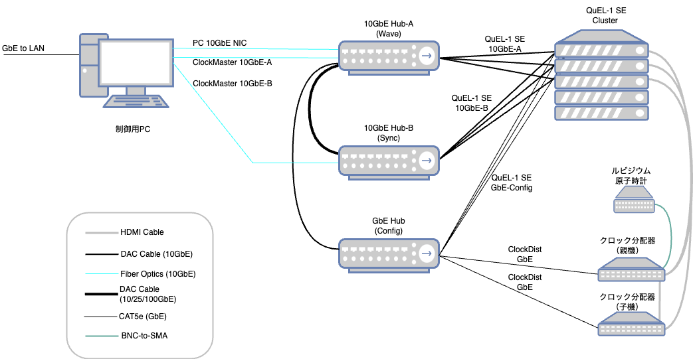
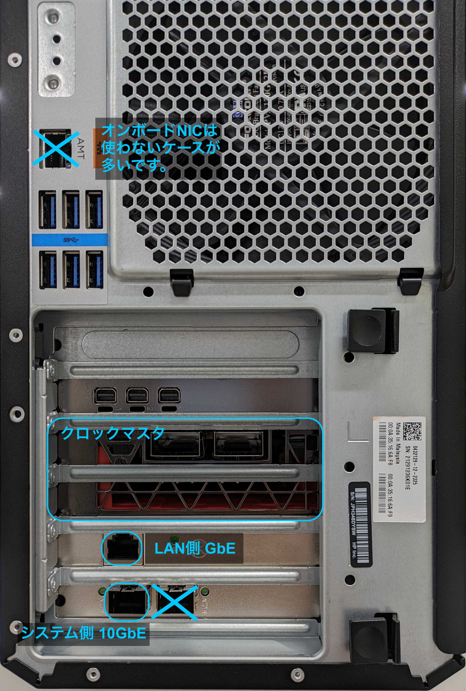

# QuEL-1/QuEL-1 SE 量子コンピュータ制御システム  ネットワーク接続例
キュエル社が提供する量子コンピュータ制御システムの全体像を、典型的なシステム接続図例を参照しながら説明します。

この例では QuEL-1 SEを16台程度含む規模の量子コンピュータ制御システムを想定しています。
このシステムの制御対象の量子コンピュータは64qubit程度の量子ビットを含むものになります。
より小規模な場合、及び、より大規模な場合については、本文書の最後で差分を説明します。

## ネットワーク構成
量子コンピュータ制御システムは生活環境のLANと切り離した専用ネットワーク上に構築してください。
これには次のような理由があります。
- 複数の制御装置間での時刻同期をネットワークを介して行うので、通信ジッタを極小にしたい。
- 制御装置群と制御用ホストPCとの間で大量のデータ通信が発生した場合に、生活環境への影響が出ないようにしたい。
- 各制御装置へアクセスできるPCを1台に限定し、実験中に予期しないアクセスの発生を防ぎたい。
- 生活環境にある様々な装置が発するブロードキャストパケットが装置に届くのを防ぎたい。

上図では、制御用ホストPCがゲートウェイとして機能すべく、2つのNICを持っています。
一方のGbE NICが生活環境のLANに接続し、もう一方の10GbE NICが量子コンピュータ制御システムの専用ネットワークに接続しています。
キュエル社がネットワークのセットアップを行う場合には、量子コンピュータ制御システムネットワークには、10.0.0.0/8 のネットワークアドレスを付与します。
このサブネット内で、各機器に次のようなルールでアドレスを割り当てています。

| 装置　              | 　インターフェース通称      | アドレス         | 　接続先ハブ      |
|------------------|------------------|--------------|-------------|
| PC               | LAN側 GbE         | DHCP         | 外部　         |
| PC               | システム側 10GbE      | 10.0.aaa.bbb | 10GbE Hub-A |
| クロックマスタ          | 10GbE A系統 (Ctrl) | 10.3.aaa.bbb | 10GbE Hub-A |
| クロックマスタ          | 10GbE B系統 (Sync) | 10.4.aaa.bbb | 10GbE Hub-B |
| クロックマスタ          | 10GbE C系統　       | 未割り当て        | なし          |
| クロックマスタ          | 10GbE D系統　       | 未割り当て        | なし          |
| クロックマスタ          | 未使用100GbE        | 未割り当て        | なし          |
| クロック分配器 (親機・子機)　 | GbE              | 10.6.ccc.ddd | GbE Hub     |
| 制御装置             | 10GbE A系統 (Wave) | 10.1.xxx.yyy | 10GbE Hub-A |
| 制御装置　            | 10GbE B系統 (Sync) | 10.2.xxx.yyy | 10GbE Hub-B |
| 制御装置             | 10GbE C系統        | 未割り当て        | なし          |
| 制御装置　            | 10GbE D系統        | 未割り当て        | なし          |
| 制御装置             | GbE (Config)     | 10.5.xxx.yyy | GbE Hub     |

## ネットワークハブ
上図では3つのネットワークハブを使い分けています。
10GbEのB系統では時刻同期用の通信をするので、他の通信の影響によるジッタの発生を防ぐ意図で、ハブを分離しています。
10GbEのA系統とGbE系統は一緒になっていても不都合はないのですが、一般的なハブ製品の構成を考えると、別々のハブとして実現するのが自然です。
３つのハブのそれぞれに、各制御装置から一本ずつケーブルを接続します。

接続数を考えると、全てのハブは制御装置群のなるべく近くに設置するのが自然です。
一方で制御用ホストPCは制御装置群と電源を別系統にするのが一般的で、また、必ずしも制御装置の近くに設置する必要はありません。
これを踏まえて、PC及びクロックマスタとハブ間はケーブル長を伸ばしやすく、また、ケーブルを介した電磁ノイズを抑えられる光ファイバを第一選択としています。

## 制御用PC
システム内の全ての制御装置にコマンドを発行し、量子コンピュータ制御システムの中核として動作します。
キュエル社が納品する場合、NICの標準構成は次のとおりです。
- オンボードのGbE NICをUbuntuサーバのインストーラが認識する場合にはLAN側 GbEとして使用します。認識しない場合には、代替のGbE NICをPCIe スロットに追加します。
- システム側 10GbE用に、PCIe x8以上のスロットにNICを追加します。 

システム側10GbE NICとしてインタフェースが2つあるカードを使う場合がありますが、 その場合には、PC背面から向かって左側のインターフェースを使用します。
以下に示す典型的な納品PCの背面パネルの写真に、使用するインターフェースを図示します。

</img>

## クロックマスタ
クロックマスタには100GbEのネットワークインターフェースが2つありますが、そのうちの1つだけを使用しています。
使用している側の100GbEインターフェースは、4分岐して4つの10GbEとして使っています。
この4つの10GbEのうち、実際に使っているのはA系統とB系統の2つだけです。
A系統は主にホストからの制御コマンドの通信、B系統は制御装置との時刻同期に用いています。
したがって、接続先のハブはそれぞれHub-A, Hub-Bという素直な接続になります。
余った分岐のC系統とD系統はハブに挿さないでください。

### クロックマスタと制御用PCの関係
複数台の制御装置を含むシステムでは、制御用ホストPCに[クロックマスタ](./ClockmasterReferenceManual.md)のPCIeカードをインストールします。
上述のとおり、PCIeスロットにはGbE NIC と 10GbE NICを追加するので、余りのスロットに挿すことになります。
クロックマスタは制御用PCのPCIeカードスロットに挿入されていますが、ホストPCからは電源供給を受けるだけでネットワーク以外の経路でのインタラクションはありません。
したがって、PCからは電源供給を受けているだけで、機能的にはPCとは独立しています。

## クロック分配器
[クロック分配器](./ClockdistReferenceManual.md)は最大で12台の制御装置に同期したクロック信号を供給します。
制御装置が12台を超えるシステムでは、従来のクロック分配器に子機をカスケードし、同期したクロック信号の分岐数を増やします。
今のところ、1段のカスケードまでを動作保証としているので、144台が1システム内の最大の制御装置数になります。
これは、近い将来に、さらに拡張される予定です。

クロック分配器は、主に制御用ホストPCからの動作状況の監視用のネットワークインターフェースを持ちます。
現状、このインターフェースを介した監視用のインフラ整備ができていませんが、提供の予定があります。
なお、親機と子機それぞれの詳細は、クロック分配器の取扱説明書をご覧ください。

## 制御装置
[制御装置](./Quel1seRiken8ReferenceManual.md)は4本の10GbEインタフェースと1本のGbEインターフェースを持ちます。
上述のとおり、4本の10GbEインターフェースのうちA系統とB系統の2本だけを使います。
残りのC系統とD系統はハブに挿さないでください。

## システム規模に応じた変更点
### 制御装置が1台だけの場合
クロック分配器は親機だけで事足ります。
クロックマスタが不要になり、また、10GbEハブを系統ごとに持つ必要性もなくなります。
10GbEの口が3つ以上、GbEの口が2つ以上あるハブを使えば、1つだけのハブでシステムを構成できます。

### 制御用PCがGbE NICを2つ持ち、10GbE NICを持たない場合
これも簡易的にシステムを組む場合に起こり得る構成です。
ハブが通信のボトルネックになりやすいのでお勧めしませんが、PCをGbEハブに繋いでも問題なく動作します。
制御装置が1台だけの場合には、使用可能なハブの選択肢が増えるメリットがあります。
なお、QuEL社では納品用の構成としては特別な事情がない限り避けることにしています。

### 制御装置が12台以下の場合
クロック分配器は親機だけで十分です。

### 制御装置の数が10GbEハブのポート数よりも多い場合
制御装置が18台を超えたあたりから、一般的な10GbEのスイッチングではポート数が足りなくなるケースが増えてきます。
その場合には、各系統ごとに複数のスイッチングハブをカスケード接続する必要が発生します。
ハブ間でループができないように気をつける以外は、特に難しいことはありません。
